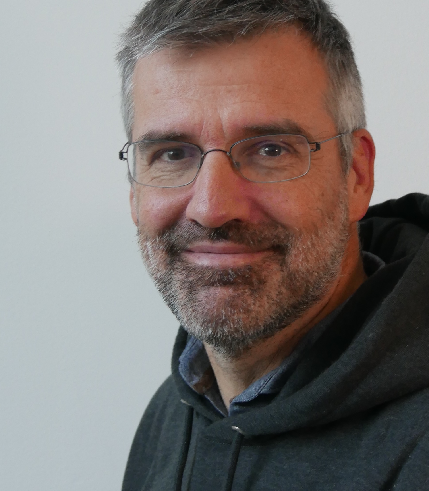

# About me

{ align=right }
I am a Belgian machine learning engineer.
I am an Italy-based consultant with years of experience with both big brands
and small business. I care about building solid and extensible designs, and
about writing good and readable code. Being a developer, I like to write tools
targeted to myself and to the others developers, to make our life easier. I
hold a Ph.D. and a Master Degree in Computer Science.

## Contact

Feel free send me an [email](mailto:cast4+blog2@gmail.com).
