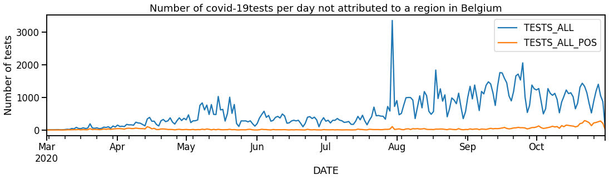
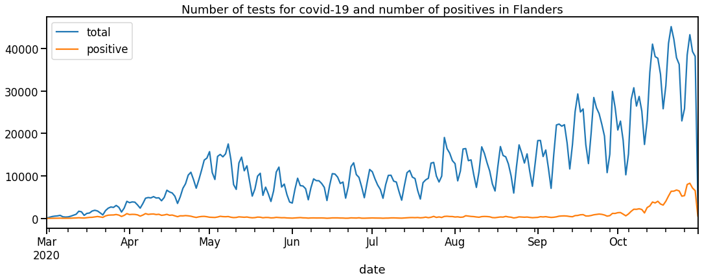
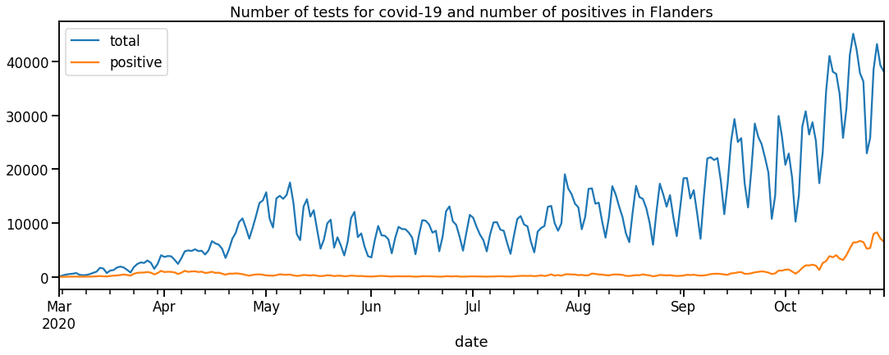
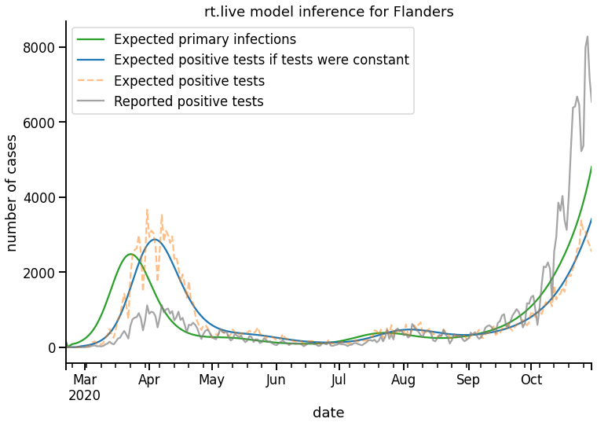
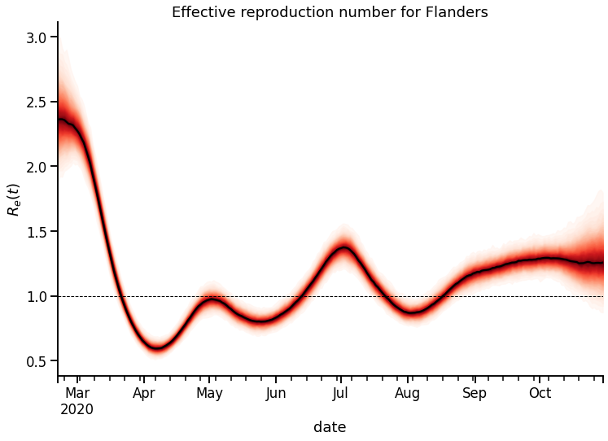
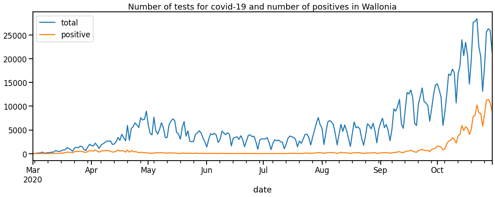
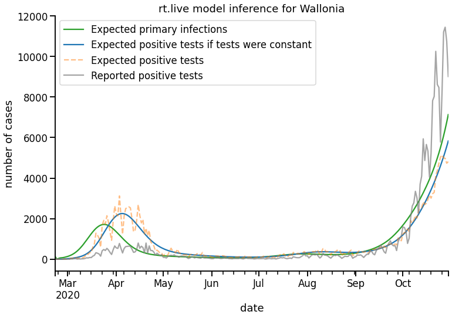
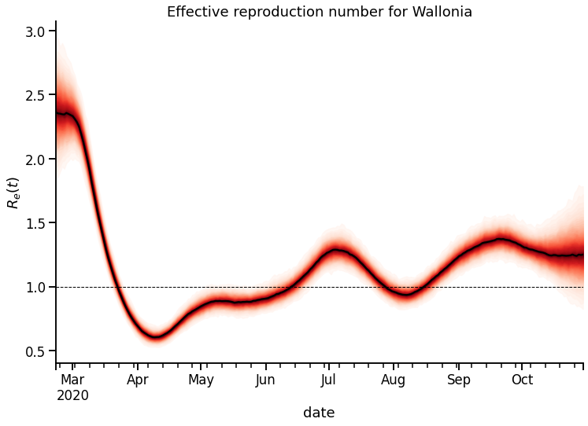

# Estimating the effective reproduction number in Belgium
> Applying the Bayesian model from Rt.live on Belgium test data.


In this post we estimate the effective reproduction number of COVID-19 in the northern and southern part of Belgium. We apply the Bayesian model of rt.live on Belgian data of COVID-19 tests provided by the goverment.

# Install needed packages and software


```
import numpy as np
import pandas as pd
```

The current version of pymc3, installed by default in Colab, is version 3.3.7. The [requirements](https://github.com/rtcovidlive/covid-model/blob/master/requirements.txt) for the Bayesian model of rt.live stipulates a more recent version. We first uninstall verions 3.3.7 and then install a version v3.9.3.


```
!pip  uninstall -y pymc3

```

    Uninstalling pymc3-3.7:
      Successfully uninstalled pymc3-3.7


```
!pip install pymc3>=3.9.2
!pip install arviz>=0.9.0
```


```
import warnings

warnings.simplefilter(action="ignore", category=FutureWarning)

import pymc3 as pm
import arviz as az
import numpy as np
import pandas as pd
from scipy import stats as sps

import theano
import theano.tensor as tt
from theano.tensor.signal.conv import conv2d

import seaborn as sns
sns.set_context('talk')
from scipy import stats
from matplotlib import pyplot as plt
```


```
print('Running on PyMC3 v{}'.format(pm.__version__))
```

    Running on PyMC3 v3.9.3


Now that we are running a recent version of pymc3, we can install the model:

`!pip install git+https://github.com/rtcovidlive/covid-model.git`

Unfortunately, this does not work. I pasted the code in this notebook as a workaround.


```
#hide

# from covid.patients import get_delay_distribution
# p_delay = pd.read_csv('https://raw.githubusercontent.com/rtcovidlive/covid-model/master/data/p_delay.csv')
# From https://github.com/rtcovidlive/covid-model/blob/master/covid/models/generative.py
```


```
#collapse

import warnings

warnings.simplefilter(action="ignore", category=FutureWarning)

import pymc3 as pm
import arviz as az
import numpy as np
import pandas as pd
from scipy import stats as sps

import theano
import theano.tensor as tt
from theano.tensor.signal.conv import conv2d

# from covid.patients import get_delay_distribution


class GenerativeModel:
    version = "1.0.0"

    def __init__(self, region: str, observed: pd.DataFrame, buffer_days=10):
        """ Takes a region (ie State) name and observed new positive and
            total test counts per day. buffer_days is the default number of
            blank days we pad on the leading edge of the time series because
            infections occur long before reports and we need to infer values
            on those days """

        first_index = observed.positive.ne(0).argmax()
        observed = observed.iloc[first_index:]
        new_index = pd.date_range(
            start=observed.index[0] - pd.Timedelta(days=buffer_days),
            end=observed.index[-1],
            freq="D",
        )
        observed = observed.reindex(new_index, fill_value=0)

        self._trace = None
        self._inference_data = None
        self.model = None
        self.observed = observed
        self.region = region

    @property
    def n_divergences(self):
        """ Returns the number of divergences from the current trace """
        assert self.trace != None, "Must run sample() first!"
        return self.trace["diverging"].nonzero()[0].size

    @property
    def inference_data(self):
        """ Returns an Arviz InferenceData object """
        assert self.trace, "Must run sample() first!"

        with self.model:
            posterior_predictive = pm.sample_posterior_predictive(self.trace)

        _inference_data = az.from_pymc3(
            trace=self.trace,
            posterior_predictive=posterior_predictive,
        )
        _inference_data.posterior.attrs["model_version"] = self.version

        return _inference_data

    @property
    def trace(self):
        """ Returns the trace from a sample() call. """
        assert self._trace, "Must run sample() first!"
        return self._trace

    def _scale_to_positives(self, data):
        """ Scales a time series to have the same mean as the observed positives
            time series. This is useful because many of the series we infer are
            relative to their true values so we make them comparable by putting
            them on the same scale. """
        scale_factor = self.observed.positive.mean() / np.mean(data)
        return scale_factor * data

    def _get_generation_time_interval(self):
        """ Create a discrete P(Generation Interval)
            Source: https://www.ijidonline.com/article/S1201-9712(20)30119-3/pdf """
        mean_si = 4.7
        std_si = 2.9
        mu_si = np.log(mean_si ** 2 / np.sqrt(std_si ** 2 + mean_si ** 2))
        sigma_si = np.sqrt(np.log(std_si ** 2 / mean_si ** 2 + 1))
        dist = sps.lognorm(scale=np.exp(mu_si), s=sigma_si)

        # Discretize the Generation Interval up to 20 days max
        g_range = np.arange(0, 20)
        gt = pd.Series(dist.cdf(g_range), index=g_range)
        gt = gt.diff().fillna(0)
        gt /= gt.sum()
        gt = gt.values
        return gt

    def _get_convolution_ready_gt(self, len_observed):
        """ Speeds up theano.scan by pre-computing the generation time interval
            vector. Thank you to Junpeng Lao for this optimization.
            Please see the outbreak simulation math here:
            https://staff.math.su.se/hoehle/blog/2020/04/15/effectiveR0.html """
        gt = self._get_generation_time_interval()
        convolution_ready_gt = np.zeros((len_observed - 1, len_observed))
        for t in range(1, len_observed):
            begin = np.maximum(0, t - len(gt) + 1)
            slice_update = gt[1 : t - begin + 1][::-1]
            convolution_ready_gt[
                t - 1, begin : begin + len(slice_update)
            ] = slice_update
        convolution_ready_gt = theano.shared(convolution_ready_gt)
        return convolution_ready_gt

    def build(self):
        """ Builds and returns the Generative model. Also sets self.model """

        # p_delay = get_delay_distribution()
        p_delay = pd.read_csv('https://raw.githubusercontent.com/rtcovidlive/covid-model/master/data/p_delay.csv')
        nonzero_days = self.observed.total.gt(0)
        len_observed = len(self.observed)
        convolution_ready_gt = self._get_convolution_ready_gt(len_observed)
        x = np.arange(len_observed)[:, None]

        coords = {
            "date": self.observed.index.values,
            "nonzero_date": self.observed.index.values[self.observed.total.gt(0)],
        }
        with pm.Model(coords=coords) as self.model:

            # Let log_r_t walk randomly with a fixed prior of ~0.035. Think
            # of this number as how quickly r_t can react.
            log_r_t = pm.GaussianRandomWalk(
                "log_r_t",
                sigma=0.035,
                dims=["date"]
            )
            r_t = pm.Deterministic("r_t", pm.math.exp(log_r_t), dims=["date"])

            # For a given seed population and R_t curve, we calculate the
            # implied infection curve by simulating an outbreak. While this may
            # look daunting, it's simply a way to recreate the outbreak
            # simulation math inside the model:
            # https://staff.math.su.se/hoehle/blog/2020/04/15/effectiveR0.html
            seed = pm.Exponential("seed", 1 / 0.02)
            y0 = tt.zeros(len_observed)
            y0 = tt.set_subtensor(y0[0], seed)
            outputs, _ = theano.scan(
                fn=lambda t, gt, y, r_t: tt.set_subtensor(y[t], tt.sum(r_t * y * gt)),
                sequences=[tt.arange(1, len_observed), convolution_ready_gt],
                outputs_info=y0,
                non_sequences=r_t,
                n_steps=len_observed - 1,
            )
            infections = pm.Deterministic("infections", outputs[-1], dims=["date"])

            # Convolve infections to confirmed positive reports based on a known
            # p_delay distribution. See patients.py for details on how we calculate
            # this distribution.
            test_adjusted_positive = pm.Deterministic(
                "test_adjusted_positive",
                conv2d(
                    tt.reshape(infections, (1, len_observed)),
                    tt.reshape(p_delay, (1, len(p_delay))),
                    border_mode="full",
                )[0, :len_observed],
                dims=["date"]
            )

            # Picking an exposure with a prior that exposure never goes below
            # 0.1 * max_tests. The 0.1 only affects early values of Rt when
            # testing was minimal or when data errors cause underreporting
            # of tests.
            tests = pm.Data("tests", self.observed.total.values, dims=["date"])
            exposure = pm.Deterministic(
                "exposure",
                pm.math.clip(tests, self.observed.total.max() * 0.1, 1e9),
                dims=["date"]
            )

            # Test-volume adjust reported cases based on an assumed exposure
            # Note: this is similar to the exposure parameter in a Poisson
            # regression.
            positive = pm.Deterministic(
                "positive", exposure * test_adjusted_positive,
                dims=["date"]
            )

            # Save data as part of trace so we can access in inference_data
            observed_positive = pm.Data("observed_positive", self.observed.positive.values, dims=["date"])
            nonzero_observed_positive = pm.Data("nonzero_observed_positive", self.observed.positive[nonzero_days.values].values, dims=["nonzero_date"])

            positive_nonzero = pm.NegativeBinomial(
                "nonzero_positive",
                mu=positive[nonzero_days.values],
                alpha=pm.Gamma("alpha", mu=6, sigma=1),
                observed=nonzero_observed_positive,
                dims=["nonzero_date"]
            )

        return self.model

    def sample(
        self,
        cores=4,
        chains=4,
        tune=700,
        draws=200,
        target_accept=0.95,
        init="jitter+adapt_diag",
    ):
        """ Runs the PyMC3 model and stores the trace result in self.trace """

        if self.model is None:
            self.build()

        with self.model:
            self._trace = pm.sample(
                draws=draws,
                cores=cores,
                chains=chains,
                target_accept=target_accept,
                tune=tune,
                init=init,
            )

        return self
```

# Get the data

Read the data from [sciensano](https://epistat.wiv-isp.be/covid/):


```
df_tests = pd.read_csv('https://epistat.sciensano.be/Data/COVID19BE_tests.csv', parse_dates=['DATE'])
```

What is in this dataframe ?


```
df_tests
```


<div>
<style scoped>
    .dataframe tbody tr th:only-of-type {
        vertical-align: middle;
    }

    .dataframe tbody tr th {
        vertical-align: top;
    }

    .dataframe thead th {
        text-align: right;
    }
</style>
<table border="1" class="dataframe">
  <thead>
    <tr style="text-align: right;">
      <th></th>
      <th>DATE</th>
      <th>PROVINCE</th>
      <th>REGION</th>
      <th>TESTS_ALL</th>
      <th>TESTS_ALL_POS</th>
    </tr>
  </thead>
  <tbody>
    <tr>
      <th>0</th>
      <td>2020-03-01</td>
      <td>Antwerpen</td>
      <td>Flanders</td>
      <td>18</td>
      <td>0</td>
    </tr>
    <tr>
      <th>1</th>
      <td>2020-03-01</td>
      <td>BrabantWallon</td>
      <td>Wallonia</td>
      <td>8</td>
      <td>0</td>
    </tr>
    <tr>
      <th>2</th>
      <td>2020-03-01</td>
      <td>Brussels</td>
      <td>Brussels</td>
      <td>4</td>
      <td>0</td>
    </tr>
    <tr>
      <th>3</th>
      <td>2020-03-01</td>
      <td>Hainaut</td>
      <td>Wallonia</td>
      <td>5</td>
      <td>0</td>
    </tr>
    <tr>
      <th>4</th>
      <td>2020-03-01</td>
      <td>Liège</td>
      <td>Wallonia</td>
      <td>8</td>
      <td>0</td>
    </tr>
    <tr>
      <th>...</th>
      <td>...</td>
      <td>...</td>
      <td>...</td>
      <td>...</td>
      <td>...</td>
    </tr>
    <tr>
      <th>2935</th>
      <td>2020-10-31</td>
      <td>NaN</td>
      <td>NaN</td>
      <td>58</td>
      <td>13</td>
    </tr>
    <tr>
      <th>2936</th>
      <td>2020-10-31</td>
      <td>Namur</td>
      <td>Wallonia</td>
      <td>864</td>
      <td>387</td>
    </tr>
    <tr>
      <th>2937</th>
      <td>2020-10-31</td>
      <td>OostVlaanderen</td>
      <td>Flanders</td>
      <td>927</td>
      <td>106</td>
    </tr>
    <tr>
      <th>2938</th>
      <td>2020-10-31</td>
      <td>VlaamsBrabant</td>
      <td>Flanders</td>
      <td>1600</td>
      <td>259</td>
    </tr>
    <tr>
      <th>2939</th>
      <td>2020-10-31</td>
      <td>WestVlaanderen</td>
      <td>Flanders</td>
      <td>512</td>
      <td>82</td>
    </tr>
  </tbody>
</table>
<p>2940 rows × 5 columns</p>
</div>


We see that we have the number of tests (TESTS_ALL) and the number of positive tests (TEST_ALL_POS) per date, province and region. In this post, we will analyse the three regions: Brussels, Flanders and Wallonia.

# Preprocessing

Are the any Nan ?


```
df_tests.isnull().mean()
```


    DATE             0.000000
    PROVINCE         0.083333
    REGION           0.083333
    TESTS_ALL        0.000000
    TESTS_ALL_POS    0.000000
    dtype: float64


About eight procent of the lines do not have a PROVINCE nor REGION assigned. What should we do with those ? Ignore them ? Let's look how many there are:


```
ax = df_tests[df_tests['REGION'].isnull()].groupby(['DATE',], dropna=False).sum().plot(figsize=(18, 4))
ax.set(title='Number of covid-19 tests per day not attributed to a region in Belgium', ylabel='Number of tests');
```


    

    


```
#hide 
# (df_tests
#     .fillna('Nan')
#     .groupby(['DATE','REGION'], as_index=False)['TESTS_ALL']
#     .sum().set_index('REGION')['TESTS_ALL']
# #    .assign(total=lambda d:d[['Brussels',	'Flanders', 'Wallonia']].sum(axis=1))
# )
```


    REGION
    Brussels        4
    Flanders       56
    Nan             1
    Wallonia       21
    Brussels       17
                ...  
    Wallonia    21127
    Brussels     1237
    Flanders     3515
    Nan            58
    Wallonia     2806
    Name: TESTS_ALL, Length: 980, dtype: int64


Here we create a function that distributes the non attributed tests according to the number of tests in each region. For example suppose on a day there are 10, 20 and 150 test in Brussels, Flanders and Wallonia respectively. Suppose there are 10 test unattributed in Flanders. Then we add 10 * (10/(10+20+150)) = 10 * (10/180) = 100/180 = 0.55 test to Flanders. The total number of test of Flanders becomes 10.55. We round that to the nearest integer: 11. And we do the same for the other regions Brussels and Wallonia. So we distribute the 10 unattributed tests weighted according to the number of tests in each region.


```
def redistribute(g, col):
  gdata = g.groupby('REGION')[col].sum()
  gdata.loc['Brussels'] += gdata.loc['Nan'] * (gdata.loc['Brussels']/(gdata.loc['Brussels'] + gdata.loc['Flanders'] + gdata.loc['Wallonia']))
  gdata.loc['Flanders'] += gdata.loc['Nan'] * (gdata.loc['Flanders']/(gdata.loc['Brussels'] + gdata.loc['Flanders'] + gdata.loc['Wallonia']))
  gdata.loc['Wallonia'] += gdata.loc['Nan'] * (gdata.loc['Wallonia']/(gdata.loc['Brussels'] + gdata.loc['Flanders'] + gdata.loc['Wallonia']))
  gdata.drop(index='Nan', inplace=True)
  gdata = np.round(gdata.fillna(0)).astype(int)
  return gdata
```


```
# Redistribute the nan for the column TESTS_ALL
df_tests_all = (df_tests
    .fillna('Nan')
    .groupby(['DATE'])
    .apply(redistribute, 'TESTS_ALL')
    .stack()
    .reset_index()
    .rename(columns={'DATE':'date', 'REGION':'region', 0:'total'})
)
```


```
# Redistribute the nan for the column TESTS_ALL_POS
df_tests_positive = (df_tests
    .fillna('Nan')
    .groupby(['DATE'])
    .apply(redistribute, 'TESTS_ALL_POS')
    .stack()
    .reset_index()
    .rename(columns={'DATE':'date', 'REGION':'region', 0:'positive'})
)
```


```
#hide

# (df_tests
#     .fillna('Nan')
#     .groupby(['DATE','REGION'])['TESTS_ALL']
#     .sum().to_frame().unstack()
#  #   .rename(pandas.index.get_level_values(0), axis='columns')
#     .assign(total=lambda d:d.drop(columns=('TESTS_ALL', 'Nan')).sum(axis=1))
# )
```


```
# Combine the total number of tests and the number of positive tests into a basetable
df_tests_per_region_day = pd.concat([df_tests_all, df_tests_positive['positive']], axis=1).set_index(['region', 'date'])
```


```
# Check if the basetable is ok
assert df_tests_per_region_day.isnull().sum().sum() == 0, 'There are nan in the basetable'
```


```
#hide

# Reformat data into Rtlive format
# df_tests_per_region_day = (df_tests
  #  .groupby(['REGION', 'DATE'], as_index=False)
  #  .agg(positive=('TESTS_ALL_POS', 'sum'), total=('TESTS_ALL', 'sum'))
  #  .rename(columns={'REGION':'region', 'DATE':'date'})
  #  .set_index(["region", "date"])
  #  )
```


```
df_tests_per_region_day
```


<div>
<style scoped>
    .dataframe tbody tr th:only-of-type {
        vertical-align: middle;
    }

    .dataframe tbody tr th {
        vertical-align: top;
    }

    .dataframe thead th {
        text-align: right;
    }
</style>
<table border="1" class="dataframe">
  <thead>
    <tr style="text-align: right;">
      <th></th>
      <th></th>
      <th>total</th>
      <th>positive</th>
    </tr>
    <tr>
      <th>region</th>
      <th>date</th>
      <th></th>
      <th></th>
    </tr>
  </thead>
  <tbody>
    <tr>
      <th>Brussels</th>
      <th>2020-03-01</th>
      <td>4</td>
      <td>0</td>
    </tr>
    <tr>
      <th>Flanders</th>
      <th>2020-03-01</th>
      <td>57</td>
      <td>0</td>
    </tr>
    <tr>
      <th>Wallonia</th>
      <th>2020-03-01</th>
      <td>21</td>
      <td>0</td>
    </tr>
    <tr>
      <th>Brussels</th>
      <th>2020-03-02</th>
      <td>17</td>
      <td>3</td>
    </tr>
    <tr>
      <th rowspan="3" valign="top">Flanders</th>
      <th>2020-03-02</th>
      <td>259</td>
      <td>7</td>
    </tr>
    <tr>
      <th>...</th>
      <td>...</td>
      <td>...</td>
    </tr>
    <tr>
      <th>2020-10-30</th>
      <td>38154</td>
      <td>6531</td>
    </tr>
    <tr>
      <th>Wallonia</th>
      <th>2020-10-30</th>
      <td>21414</td>
      <td>9011</td>
    </tr>
    <tr>
      <th>Brussels</th>
      <th>2020-10-31</th>
      <td>1246</td>
      <td>392</td>
    </tr>
    <tr>
      <th>Flanders</th>
      <th>2020-10-31</th>
      <td>3542</td>
      <td>531</td>
    </tr>
    <tr>
      <th>Wallonia</th>
      <th>2020-10-31</th>
      <td>2827</td>
      <td>951</td>
    </tr>
  </tbody>
</table>
<p>735 rows × 2 columns</p>
</div>


```
# What regions do we have in the table ?
df_tests_per_region_day.index.get_level_values(0).unique().to_list()
```


    ['Brussels', 'Flanders', 'Wallonia']


# Re(t) for Flanders


```
region = 'Flanders'
```


```
ax = df_tests_per_region_day.loc[region].plot(figsize=(18,6))
ax.set(title=f'Number of tests for covid-19 and number of positives in {region}');
```


    

    


```
import datetime
from dateutil.relativedelta import relativedelta
```


```
# Remove last two days because tests are not yet fully reported
today_minus_two = datetime.datetime.today() + relativedelta(days=-2)
today_minus_two.strftime("%Y-%m-%d")
```


    '2020-10-30'


```
ax = df_tests_per_region_day.loc[region][:today_minus_two].plot(figsize=(18,6))
ax.set(title=f'Number of tests for covid-19 and number of positives in {region}');
```


    

    


```
# Fit the model on the data
df = df_tests_per_region_day.loc[region][:today_minus_two]
gm = GenerativeModel(region, df)
gm.sample()
```

    Only 200 samples in chain.
    Auto-assigning NUTS sampler...
    Initializing NUTS using jitter+adapt_diag...
    Multiprocess sampling (4 chains in 4 jobs)
    NUTS: [alpha, seed, log_r_t]


<div>
    <style>
        /* Turns off some styling */
        progress {
            /* gets rid of default border in Firefox and Opera. */
            border: none;
            /* Needs to be in here for Safari polyfill so background images work as expected. */
            background-size: auto;
        }
        .progress-bar-interrupted, .progress-bar-interrupted::-webkit-progress-bar {
            background: #F44336;
        }
    </style>
  <progress value='3600' class='' max='3600' style='width:300px; height:20px; vertical-align: middle;'></progress>
  100.00% [3600/3600 1:10:58<00:00 Sampling 4 chains, 0 divergences]
</div>


    Sampling 4 chains for 700 tune and 200 draw iterations (2_800 + 800 draws total) took 4260 seconds.


    <__main__.GenerativeModel at 0x7f382109add8>


```
#collapse

def summarize_inference_data(inference_data: az.InferenceData):
    """ Summarizes an inference_data object into the form that we publish on rt.live """
    posterior = inference_data.posterior
    hdi_mass = 80
    hpdi = az.hdi(posterior.r_t, hdi_prob=hdi_mass / 100).r_t

    observed_positive = inference_data.constant_data.observed_positive.to_series()
    scale_to_positives = lambda data: observed_positive.mean() / np.mean(data) * data
    tests = inference_data.constant_data.tests.to_series()
    normalized_positive = observed_positive / tests.clip(0.1 * tests.max())

    summary = pd.DataFrame(
        data={
            "mean": posterior.r_t.mean(["draw", "chain"]),
            "median": posterior.r_t.median(["chain", "draw"]),
            f"lower_{hdi_mass}": hpdi[:, 0],
            f"upper_{hdi_mass}": hpdi[:, 1],
            "infections": scale_to_positives(
                posterior.infections.mean(["draw", "chain"])
            ),
            "test_adjusted_positive": scale_to_positives(
                posterior.test_adjusted_positive.mean(["draw", "chain"])
            ),
            "test_adjusted_positive_raw": scale_to_positives(normalized_positive),
            "positive": observed_positive,
            "tests": tests,
        },
        index=pd.Index(posterior.date.values, name="date"),
    )
    return summary
```


```
result = summarize_inference_data(gm.inference_data)
```


<div>
    <style>
        /* Turns off some styling */
        progress {
            /* gets rid of default border in Firefox and Opera. */
            border: none;
            /* Needs to be in here for Safari polyfill so background images work as expected. */
            background-size: auto;
        }
        .progress-bar-interrupted, .progress-bar-interrupted::-webkit-progress-bar {
            background: #F44336;
        }
    </style>
  <progress value='800' class='' max='800' style='width:300px; height:20px; vertical-align: middle;'></progress>
  100.00% [800/800 00:12<00:00]
</div>


```
fig, ax = plt.subplots(figsize=(12, 8))
result.infections.plot(c="C2", label="Expected primary infections")
result.test_adjusted_positive.plot(c="C0", label="Expected positive tests if tests were constant")
result.test_adjusted_positive_raw.plot(c="C1", alpha=.5, label="Expected positive tests", style="--")
gm.observed.positive.plot(c="C7", alpha=.7, label="Reported positive tests")
fig.set_facecolor("w")
ax.legend();
ax.set(title=f"rt.live model inference for {region}", ylabel="number of cases")
sns.despine();
```


    

    


```
fig, ax = plt.subplots(figsize=(12, 8))
 
ax.set(title=f"Effective reproduction number for {region}", ylabel="$R_e(t)$")
samples = gm.trace["r_t"]
x = result.index
cmap = plt.get_cmap("Reds")
percs = np.linspace(51, 99, 40)
colors = (percs - np.min(percs)) / (np.max(percs) - np.min(percs))
samples = samples.T

result["median"].plot(c="k", ls='-')

for i, p in enumerate(percs[::-1]):
    upper = np.percentile(samples, p, axis=1)
    lower = np.percentile(samples, 100-p, axis=1)
    color_val = colors[i]
    ax.fill_between(x, upper, lower, color=cmap(color_val), alpha=.8)

ax.axhline(1.0, c="k", lw=1, linestyle="--")
sns.despine();
```


    

    


# Re(t) for Wallonia


```
region = 'Wallonia'
```


```
ax = df_tests_per_region_day.loc[region].plot(figsize=(18,6))
ax.set(title=f'Number of tests for covid-19 and number of positives in {region}');
```


    

    


```
# Remove last two days because tests are not yet fully reported
today_minus_two = datetime.datetime.today() + relativedelta(days=-2)
today_minus_two.strftime("%Y-%m-%d")
```


    '2020-10-30'


```
ax = df_tests_per_region_day.loc[region][:today_minus_two].plot(figsize=(18,6))
ax.set(title=f'Number of tests for covid-19 and number of positives in {region}');
```


    

    


```
df = df_tests_per_region_day.loc[region][:today_minus_two]
gm = GenerativeModel(region, df)
gm.sample()
```

    Only 200 samples in chain.
    Auto-assigning NUTS sampler...
    Initializing NUTS using jitter+adapt_diag...
    Multiprocess sampling (4 chains in 4 jobs)
    NUTS: [alpha, seed, log_r_t]


<div>
    <style>
        /* Turns off some styling */
        progress {
            /* gets rid of default border in Firefox and Opera. */
            border: none;
            /* Needs to be in here for Safari polyfill so background images work as expected. */
            background-size: auto;
        }
        .progress-bar-interrupted, .progress-bar-interrupted::-webkit-progress-bar {
            background: #F44336;
        }
    </style>
  <progress value='3600' class='' max='3600' style='width:300px; height:20px; vertical-align: middle;'></progress>
  100.00% [3600/3600 1:12:49<00:00 Sampling 4 chains, 0 divergences]
</div>


    Sampling 4 chains for 700 tune and 200 draw iterations (2_800 + 800 draws total) took 4371 seconds.


    <__main__.GenerativeModel at 0x7f380ac35c88>


```
result = summarize_inference_data(gm.inference_data)
```


<div>
    <style>
        /* Turns off some styling */
        progress {
            /* gets rid of default border in Firefox and Opera. */
            border: none;
            /* Needs to be in here for Safari polyfill so background images work as expected. */
            background-size: auto;
        }
        .progress-bar-interrupted, .progress-bar-interrupted::-webkit-progress-bar {
            background: #F44336;
        }
    </style>
  <progress value='800' class='' max='800' style='width:300px; height:20px; vertical-align: middle;'></progress>
  100.00% [800/800 00:12<00:00]
</div>


```
fig, ax = plt.subplots(figsize=(12, 8))
result.infections.plot(c="C2", label="Expected primary infections")
result.test_adjusted_positive.plot(c="C0", label="Expected positive tests if tests were constant")
result.test_adjusted_positive_raw.plot(c="C1", alpha=.5, label="Expected positive tests", style="--")
gm.observed.positive.plot(c="C7", alpha=.7, label="Reported positive tests")
fig.set_facecolor("w")
ax.legend();
ax.set(title=f"rt.live model inference for {region}", ylabel="number of cases")
sns.despine();
```


    

    


```
fig, ax = plt.subplots(figsize=(12, 8))
 
ax.set(title=f"Effective reproduction number for {region}", ylabel="$R_e(t)$")
samples = gm.trace["r_t"]
x = result.index
cmap = plt.get_cmap("Reds")
percs = np.linspace(51, 99, 40)
colors = (percs - np.min(percs)) / (np.max(percs) - np.min(percs))
samples = samples.T

result["median"].plot(c="k", ls='-')

for i, p in enumerate(percs[::-1]):
    upper = np.percentile(samples, p, axis=1)
    lower = np.percentile(samples, 100-p, axis=1)
    color_val = colors[i]
    ax.fill_between(x, upper, lower, color=cmap(color_val), alpha=.8)

ax.axhline(1.0, c="k", lw=1, linestyle="--")
sns.despine();
```


    

    


```

```

<!-- more -->
