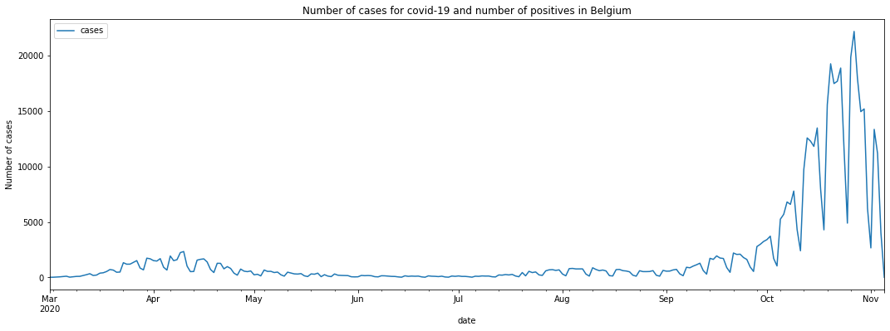
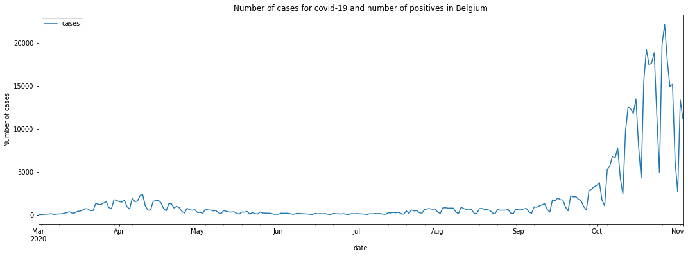
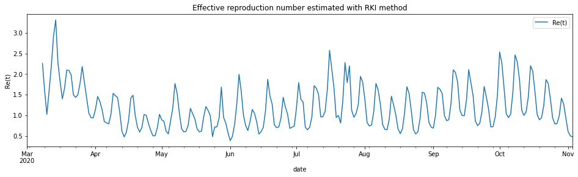
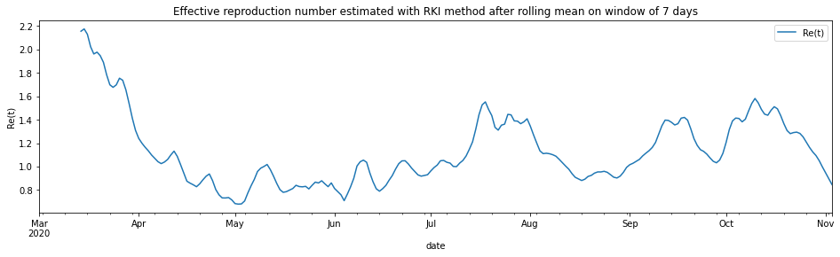

# Estimating the effective reproduction number in Belgium with the RKI method
> Using the Robert Koch Institute method with serial interval of 4.


Every day [Bart Mesuere](https://twitter.com/BartMesuere) tweets a nice dashboard with current numbers about Covid-19 in Belgium. This was the tweet on Wednesday 20/11/04:
  
  > twitter: https://twitter.com/BartMesuere/status/1323881489864548352

It's nice to see that the effective reproduction number ($Re(t)$) is again below one. That means the power of virus is declining and the number of infection will start to lower. This occured first on Tuesday 2020/11/3:

   > twitter: https://twitter.com/BartMesuere/status/1323519613855059968
   

I estimated the $Re(t)$ earlier with [rt.live](https://github.com/rtcovidlive/covid-model) model in [this notebook](https://cast42.github.io/blog/cast42/covid19/belgium/2020/11/01/rt-be-region.html). There the $Re(t)$ was still estimated to be above one. [Michael Osthege](https://twitter.com/theCake) replied with a simulation results with furter improved [model](https://github.com/rtcovidlive/rtlive-global):

   > twitter: https://twitter.com/theCake/status/1323211910481874944

   

In that estimation, the $Re(t)$ was also not yet heading below one at the end of october.

In this notebook, we will implement a calculation based on the method of the Robert Koch Institute. The method is described and programmed in R in this [blog post](https://staff.math.su.se/hoehle/blog/2020/04/15/effectiveR0.html).

In that blogpost there's a link to a website with estimations for most places in the world [The estimation for Belgium is here](https://epiforecasts.io/covid/posts/national/belgium/)


According to that calculation, $Re(t)$ is already below zero for some days.

# Load libraries and data


```
import numpy as np
import pandas as pd
```


```
df_tests = pd.read_csv('https://epistat.sciensano.be/Data/COVID19BE_tests.csv', parse_dates=['DATE'])
```


```
df_cases = pd.read_csv('https://epistat.sciensano.be/Data/COVID19BE_CASES_AGESEX.csv', parse_dates=['DATE'])
df_cases
```


<div>
<style scoped>
    .dataframe tbody tr th:only-of-type {
        vertical-align: middle;
    }

    .dataframe tbody tr th {
        vertical-align: top;
    }

    .dataframe thead th {
        text-align: right;
    }
</style>
<table border="1" class="dataframe">
  <thead>
    <tr style="text-align: right;">
      <th></th>
      <th>DATE</th>
      <th>PROVINCE</th>
      <th>REGION</th>
      <th>AGEGROUP</th>
      <th>SEX</th>
      <th>CASES</th>
    </tr>
  </thead>
  <tbody>
    <tr>
      <th>0</th>
      <td>2020-03-01</td>
      <td>Antwerpen</td>
      <td>Flanders</td>
      <td>40-49</td>
      <td>M</td>
      <td>1</td>
    </tr>
    <tr>
      <th>1</th>
      <td>2020-03-01</td>
      <td>Brussels</td>
      <td>Brussels</td>
      <td>10-19</td>
      <td>F</td>
      <td>1</td>
    </tr>
    <tr>
      <th>2</th>
      <td>2020-03-01</td>
      <td>Brussels</td>
      <td>Brussels</td>
      <td>10-19</td>
      <td>M</td>
      <td>1</td>
    </tr>
    <tr>
      <th>3</th>
      <td>2020-03-01</td>
      <td>Brussels</td>
      <td>Brussels</td>
      <td>20-29</td>
      <td>M</td>
      <td>1</td>
    </tr>
    <tr>
      <th>4</th>
      <td>2020-03-01</td>
      <td>Brussels</td>
      <td>Brussels</td>
      <td>30-39</td>
      <td>F</td>
      <td>1</td>
    </tr>
    <tr>
      <th>...</th>
      <td>...</td>
      <td>...</td>
      <td>...</td>
      <td>...</td>
      <td>...</td>
      <td>...</td>
    </tr>
    <tr>
      <th>36279</th>
      <td>NaT</td>
      <td>VlaamsBrabant</td>
      <td>Flanders</td>
      <td>40-49</td>
      <td>M</td>
      <td>3</td>
    </tr>
    <tr>
      <th>36280</th>
      <td>NaT</td>
      <td>VlaamsBrabant</td>
      <td>Flanders</td>
      <td>50-59</td>
      <td>M</td>
      <td>1</td>
    </tr>
    <tr>
      <th>36281</th>
      <td>NaT</td>
      <td>WestVlaanderen</td>
      <td>Flanders</td>
      <td>20-29</td>
      <td>F</td>
      <td>1</td>
    </tr>
    <tr>
      <th>36282</th>
      <td>NaT</td>
      <td>WestVlaanderen</td>
      <td>Flanders</td>
      <td>50-59</td>
      <td>M</td>
      <td>3</td>
    </tr>
    <tr>
      <th>36283</th>
      <td>NaT</td>
      <td>NaN</td>
      <td>NaN</td>
      <td>NaN</td>
      <td>NaN</td>
      <td>1</td>
    </tr>
  </tbody>
</table>
<p>36284 rows × 6 columns</p>
</div>


Reformat data into Rtlive format


```
df_cases_per_day = (df_cases
   .dropna(subset=['DATE'])
   .assign(region='Belgium')
   .groupby(['region', 'DATE'], as_index=False)
   .agg(cases=('CASES', 'sum'))
   .rename(columns={'DATE':'date'})
   .set_index(["region", "date"])
)
```

What's in our basetable:


```
df_cases_per_day
```


<div>
<style scoped>
    .dataframe tbody tr th:only-of-type {
        vertical-align: middle;
    }

    .dataframe tbody tr th {
        vertical-align: top;
    }

    .dataframe thead th {
        text-align: right;
    }
</style>
<table border="1" class="dataframe">
  <thead>
    <tr style="text-align: right;">
      <th></th>
      <th></th>
      <th>cases</th>
    </tr>
    <tr>
      <th>region</th>
      <th>date</th>
      <th></th>
    </tr>
  </thead>
  <tbody>
    <tr>
      <th rowspan="11" valign="top">Belgium</th>
      <th>2020-03-01</th>
      <td>19</td>
    </tr>
    <tr>
      <th>2020-03-02</th>
      <td>19</td>
    </tr>
    <tr>
      <th>2020-03-03</th>
      <td>34</td>
    </tr>
    <tr>
      <th>2020-03-04</th>
      <td>53</td>
    </tr>
    <tr>
      <th>2020-03-05</th>
      <td>81</td>
    </tr>
    <tr>
      <th>...</th>
      <td>...</td>
    </tr>
    <tr>
      <th>2020-11-01</th>
      <td>2660</td>
    </tr>
    <tr>
      <th>2020-11-02</th>
      <td>13345</td>
    </tr>
    <tr>
      <th>2020-11-03</th>
      <td>11167</td>
    </tr>
    <tr>
      <th>2020-11-04</th>
      <td>4019</td>
    </tr>
    <tr>
      <th>2020-11-05</th>
      <td>5</td>
    </tr>
  </tbody>
</table>
<p>250 rows × 1 columns</p>
</div>


Let's plot the number of cases in function of the time.


```
ax = df_cases_per_day.loc['Belgium'].plot(figsize=(18,6))
ax.set(ylabel='Number of cases', title='Number of cases for covid-19 and number of positives in Belgium');
```


    

    


We see that the last days are not yet complete. Let's cut off the last two days of reporting.


```
import datetime
from dateutil.relativedelta import relativedelta
```

Calculate the date two days ago:


```
datetime.date(2020, 11, 3)
```


    datetime.date(2020, 11, 3)


```
# today_minus_two = datetime.date.today() + relativedelta(days=-2)
today_minus_two = datetime.date(2020, 11, 3) # Fix the day
today_minus_two.strftime("%Y-%m-%d")
```


    '2020-11-03'


Replot the cases:


```
ax = df_cases_per_day.loc['Belgium'][:today_minus_two].plot(figsize=(18,6))
ax.set(ylabel='Number of cases', title='Number of cases for covid-19 and number of positives in Belgium');
```


    

    


Select the Belgium region:


```
region = 'Belgium'
df = df_cases_per_day.loc[region][:today_minus_two]
df
```


<div>
<style scoped>
    .dataframe tbody tr th:only-of-type {
        vertical-align: middle;
    }

    .dataframe tbody tr th {
        vertical-align: top;
    }

    .dataframe thead th {
        text-align: right;
    }
</style>
<table border="1" class="dataframe">
  <thead>
    <tr style="text-align: right;">
      <th></th>
      <th>cases</th>
    </tr>
    <tr>
      <th>date</th>
      <th></th>
    </tr>
  </thead>
  <tbody>
    <tr>
      <th>2020-03-01</th>
      <td>19</td>
    </tr>
    <tr>
      <th>2020-03-02</th>
      <td>19</td>
    </tr>
    <tr>
      <th>2020-03-03</th>
      <td>34</td>
    </tr>
    <tr>
      <th>2020-03-04</th>
      <td>53</td>
    </tr>
    <tr>
      <th>2020-03-05</th>
      <td>81</td>
    </tr>
    <tr>
      <th>...</th>
      <td>...</td>
    </tr>
    <tr>
      <th>2020-10-30</th>
      <td>15185</td>
    </tr>
    <tr>
      <th>2020-10-31</th>
      <td>6243</td>
    </tr>
    <tr>
      <th>2020-11-01</th>
      <td>2660</td>
    </tr>
    <tr>
      <th>2020-11-02</th>
      <td>13345</td>
    </tr>
    <tr>
      <th>2020-11-03</th>
      <td>11167</td>
    </tr>
  </tbody>
</table>
<p>248 rows × 1 columns</p>
</div>


Check the types of the columns:


```
df.info()
```

    <class 'pandas.core.frame.DataFrame'>
    DatetimeIndex: 248 entries, 2020-03-01 to 2020-11-03
    Data columns (total 1 columns):
     #   Column  Non-Null Count  Dtype
    ---  ------  --------------  -----
     0   cases   248 non-null    int64
    dtypes: int64(1)
    memory usage: 3.9 KB


# Robert Koch Institute method

A basic method to calculate the effective reproduction number is described (among others) in this [blogpost](https://staff.math.su.se/hoehle/blog/2020/04/15/effectiveR0.html). I included the relevant paragraph:

In a recent report (an der Heiden and Hamouda 2020) the RKI described their method for computing R as part of the COVID-19 outbreak as follows (p. 13): For a constant generation time of 4 days, one obtains R
 as the ratio of new infections in two consecutive time periods each consisting of 4 days. Mathematically, this estimation could be formulated as part of a statistical model:

$$y_{s+4} | y_{s} \sim Po(R \cdot y_{s}), s= 1,2,3,4$$

where $y_{1}, \ldots, y_{4}$ are considered as fixed. From this we obtain 

$$\hat{R}_{RKI} = \sum_{s=1}^{4} y_{s+4} / \sum_{s=1}^{4} y_{s}$$

Somewhat arbitrary, we denote by $Re(t)$ the above estimate for 
R when $s=1$ corresponds to time $t-8$, i.e. we assign the obtained value to the last of the 8 values used in the computation.

In Python, we define a lambda function that we apply on a rolling window. Since indexes start from zero, we calculate:

$$\hat{R}_{RKI} = \sum_{s=0}^{3} y_{s+4} / \sum_{s=0}^{3} y_{s}$$


```
rt = lambda y: np.sum(y[4:])/np.sum(y[:4])
```


```
df.rolling(8).apply(rt)
```


<div>
<style scoped>
    .dataframe tbody tr th:only-of-type {
        vertical-align: middle;
    }

    .dataframe tbody tr th {
        vertical-align: top;
    }

    .dataframe thead th {
        text-align: right;
    }
</style>
<table border="1" class="dataframe">
  <thead>
    <tr style="text-align: right;">
      <th></th>
      <th>cases</th>
    </tr>
    <tr>
      <th>date</th>
      <th></th>
    </tr>
  </thead>
  <tbody>
    <tr>
      <th>2020-03-01</th>
      <td>NaN</td>
    </tr>
    <tr>
      <th>2020-03-02</th>
      <td>NaN</td>
    </tr>
    <tr>
      <th>2020-03-03</th>
      <td>NaN</td>
    </tr>
    <tr>
      <th>2020-03-04</th>
      <td>NaN</td>
    </tr>
    <tr>
      <th>2020-03-05</th>
      <td>NaN</td>
    </tr>
    <tr>
      <th>...</th>
      <td>...</td>
    </tr>
    <tr>
      <th>2020-10-30</th>
      <td>1.273703</td>
    </tr>
    <tr>
      <th>2020-10-31</th>
      <td>0.929291</td>
    </tr>
    <tr>
      <th>2020-11-01</th>
      <td>0.601838</td>
    </tr>
    <tr>
      <th>2020-11-02</th>
      <td>0.499806</td>
    </tr>
    <tr>
      <th>2020-11-03</th>
      <td>0.475685</td>
    </tr>
  </tbody>
</table>
<p>248 rows × 1 columns</p>
</div>


The first values are Nan because the window is in the past. If we plot the result, it looks like this:


```
ax = df.rolling(8).apply(rt).plot(figsize=(16,4), label='Re(t)')
ax.set(ylabel='Re(t)', title='Effective reproduction number estimated with RKI method')
ax.legend(['Re(t)']);
```


    

    


To avoid the spikes due to weekend reporting issue, I first applied a rolling mean on a window of 7 days:


```
ax = df.rolling(7).mean().rolling(8).apply(rt).plot(figsize=(16,4), label='Re(t)')
ax.set(ylabel='Re(t)', title='Effective reproduction number estimated with RKI method after rolling mean on window of 7 days')
ax.legend(['Re(t)']);
```


    

    


# Interactive visualisation in Altair


```
import altair as alt

alt.Chart(df.rolling(7).mean().rolling(8).apply(rt).fillna(0).reset_index()).mark_line().encode(
    x=alt.X('date:T'),
    y=alt.Y('cases', title='Re(t)'),
    tooltip=['date:T', alt.Tooltip('cases', format='.2f')]
).transform_filter(
    alt.datum.date > alt.expr.toDate('2020-03-13')
).properties(
    width=600,
    title='Effective reproduction number in Belgium based on Robert-Koch Institute method'
)
```


<div id="altair-viz-8aa848a096114e55a92f80251a7d08bb"></div>
<script type="text/javascript">
  (function(spec, embedOpt){
    let outputDiv = document.currentScript.previousElementSibling;
    if (outputDiv.id !== "altair-viz-8aa848a096114e55a92f80251a7d08bb") {
      outputDiv = document.getElementById("altair-viz-8aa848a096114e55a92f80251a7d08bb");
    }
    const paths = {
      "vega": "https://cdn.jsdelivr.net/npm//vega@5?noext",
      "vega-lib": "https://cdn.jsdelivr.net/npm//vega-lib?noext",
      "vega-lite": "https://cdn.jsdelivr.net/npm//vega-lite@4.8.1?noext",
      "vega-embed": "https://cdn.jsdelivr.net/npm//vega-embed@6?noext",
    };

    function loadScript(lib) {
      return new Promise(function(resolve, reject) {
        var s = document.createElement('script');
        s.src = paths[lib];
        s.async = true;
        s.onload = () => resolve(paths[lib]);
        s.onerror = () => reject(`Error loading script: ${paths[lib]}`);
        document.getElementsByTagName("head")[0].appendChild(s);
      });
    }

    function showError(err) {
      outputDiv.innerHTML = `<div class="error" style="color:red;">${err}</div>`;
      throw err;
    }

    function displayChart(vegaEmbed) {
      vegaEmbed(outputDiv, spec, embedOpt)
        .catch(err => showError(`Javascript Error: ${err.message}<br>This usually means there's a typo in your chart specification. See the javascript console for the full traceback.`));
    }

    if(typeof define === "function" && define.amd) {
      requirejs.config({paths});
      require(["vega-embed"], displayChart, err => showError(`Error loading script: ${err.message}`));
    } else if (typeof vegaEmbed === "function") {
      displayChart(vegaEmbed);
    } else {
      loadScript("vega")
        .then(() => loadScript("vega-lite"))
        .then(() => loadScript("vega-embed"))
        .catch(showError)
        .then(() => displayChart(vegaEmbed));
    }
  })({"config": {"view": {"continuousWidth": 400, "continuousHeight": 300}}, "data": {"name": "data-8f6b755fa8c1d7435c13e24ac4ae54d3"}, "mark": "line", "encoding": {"tooltip": [{"type": "temporal", "field": "date"}, {"type": "quantitative", "field": "cases", "format": ".2f"}], "x": {"type": "temporal", "field": "date"}, "y": {"type": "quantitative", "field": "cases", "title": "Re(t)"}}, "title": "Effective reproduction number in Belgium based on Robert-Koch Institute method", "transform": [{"filter": "(datum.date > toDate('2020-03-13'))"}], "width": 600, "$schema": "https://vega.github.io/schema/vega-lite/v4.8.1.json", "datasets": {"data-8f6b755fa8c1d7435c13e24ac4ae54d3": [{"date": "2020-03-01T00:00:00", "cases": 0.0}, {"date": "2020-03-02T00:00:00", "cases": 0.0}, {"date": "2020-03-03T00:00:00", "cases": 0.0}, {"date": "2020-03-04T00:00:00", "cases": 0.0}, {"date": "2020-03-05T00:00:00", "cases": 0.0}, {"date": "2020-03-06T00:00:00", "cases": 0.0}, {"date": "2020-03-07T00:00:00", "cases": 0.0}, {"date": "2020-03-08T00:00:00", "cases": 0.0}, {"date": "2020-03-09T00:00:00", "cases": 0.0}, {"date": "2020-03-10T00:00:00", "cases": 0.0}, {"date": "2020-03-11T00:00:00", "cases": 0.0}, {"date": "2020-03-12T00:00:00", "cases": 0.0}, {"date": "2020-03-13T00:00:00", "cases": 0.0}, {"date": "2020-03-14T00:00:00", "cases": 2.1550522648083623}, {"date": "2020-03-15T00:00:00", "cases": 2.1745562130177514}, {"date": "2020-03-16T00:00:00", "cases": 2.128966639544345}, {"date": "2020-03-17T00:00:00", "cases": 2.0226899046366325}, {"date": "2020-03-18T00:00:00", "cases": 1.9609269738614927}, {"date": "2020-03-19T00:00:00", "cases": 1.9764172335600907}, {"date": "2020-03-20T00:00:00", "cases": 1.9464934072233904}, {"date": "2020-03-21T00:00:00", "cases": 1.8896114452934483}, {"date": "2020-03-22T00:00:00", "cases": 1.7826027209014708}, {"date": "2020-03-23T00:00:00", "cases": 1.6979118861863238}, {"date": "2020-03-24T00:00:00", "cases": 1.6763204398193596}, {"date": "2020-03-25T00:00:00", "cases": 1.6971521982276518}, {"date": "2020-03-26T00:00:00", "cases": 1.7541628122109156}, {"date": "2020-03-27T00:00:00", "cases": 1.73653625244949}, {"date": "2020-03-28T00:00:00", "cases": 1.654172767203514}, {"date": "2020-03-29T00:00:00", "cases": 1.5372097739024642}, {"date": "2020-03-30T00:00:00", "cases": 1.4133597011645793}, {"date": "2020-03-31T00:00:00", "cases": 1.3085723179890267}, {"date": "2020-04-01T00:00:00", "cases": 1.2405381483448399}, {"date": "2020-04-02T00:00:00", "cases": 1.1993206476931701}, {"date": "2020-04-03T00:00:00", "cases": 1.1647958707751622}, {"date": "2020-04-04T00:00:00", "cases": 1.134348330310149}, {"date": "2020-04-05T00:00:00", "cases": 1.098718570735466}, {"date": "2020-04-06T00:00:00", "cases": 1.07047598097176}, {"date": "2020-04-07T00:00:00", "cases": 1.0416166146125305}, {"date": "2020-04-08T00:00:00", "cases": 1.025349306629617}, {"date": "2020-04-09T00:00:00", "cases": 1.0386773338874746}, {"date": "2020-04-10T00:00:00", "cases": 1.0610326226560494}, {"date": "2020-04-11T00:00:00", "cases": 1.0993849308047157}, {"date": "2020-04-12T00:00:00", "cases": 1.131743109883929}, {"date": "2020-04-13T00:00:00", "cases": 1.0873033735964188}, {"date": "2020-04-14T00:00:00", "cases": 1.019028712535709}, {"date": "2020-04-15T00:00:00", "cases": 0.9472236467900601}, {"date": "2020-04-16T00:00:00", "cases": 0.8754150947658524}, {"date": "2020-04-17T00:00:00", "cases": 0.8584801508809051}, {"date": "2020-04-18T00:00:00", "cases": 0.8444835123063765}, {"date": "2020-04-19T00:00:00", "cases": 0.8281488408721759}, {"date": "2020-04-20T00:00:00", "cases": 0.8531172584640793}, {"date": "2020-04-21T00:00:00", "cases": 0.8873677160080377}, {"date": "2020-04-22T00:00:00", "cases": 0.9180498508974287}, {"date": "2020-04-23T00:00:00", "cases": 0.9369112359216666}, {"date": "2020-04-24T00:00:00", "cases": 0.8802480338777979}, {"date": "2020-04-25T00:00:00", "cases": 0.8040216177047793}, {"date": "2020-04-26T00:00:00", "cases": 0.7592620966506297}, {"date": "2020-04-27T00:00:00", "cases": 0.7327137782288758}, {"date": "2020-04-28T00:00:00", "cases": 0.7321741520909936}, {"date": "2020-04-29T00:00:00", "cases": 0.7357116034547503}, {"date": "2020-04-30T00:00:00", "cases": 0.7153812003067361}, {"date": "2020-05-01T00:00:00", "cases": 0.6841695164711484}, {"date": "2020-05-02T00:00:00", "cases": 0.6797765992396865}, {"date": "2020-05-03T00:00:00", "cases": 0.6815536953858718}, {"date": "2020-05-04T00:00:00", "cases": 0.7067418899858956}, {"date": "2020-05-05T00:00:00", "cases": 0.7752609933565329}, {"date": "2020-05-06T00:00:00", "cases": 0.8361640430820214}, {"date": "2020-05-07T00:00:00", "cases": 0.8904366060061408}, {"date": "2020-05-08T00:00:00", "cases": 0.9579308693222638}, {"date": "2020-05-09T00:00:00", "cases": 0.9863706847302701}, {"date": "2020-05-10T00:00:00", "cases": 1.0007431260837254}, {"date": "2020-05-11T00:00:00", "cases": 1.0179983179142136}, {"date": "2020-05-12T00:00:00", "cases": 0.9741666666666667}, {"date": "2020-05-13T00:00:00", "cases": 0.9176733410557668}, {"date": "2020-05-14T00:00:00", "cases": 0.8561881188118813}, {"date": "2020-05-15T00:00:00", "cases": 0.8030403172504956}, {"date": "2020-05-16T00:00:00", "cases": 0.7803250641573994}, {"date": "2020-05-17T00:00:00", "cases": 0.786042737354612}, {"date": "2020-05-18T00:00:00", "cases": 0.7990748771321191}, {"date": "2020-05-19T00:00:00", "cases": 0.8127572016460906}, {"date": "2020-05-20T00:00:00", "cases": 0.8402762552071914}, {"date": "2020-05-21T00:00:00", "cases": 0.8295480614819913}, {"date": "2020-05-22T00:00:00", "cases": 0.8273034249879401}, {"date": "2020-05-23T00:00:00", "cases": 0.8312658227848102}, {"date": "2020-05-24T00:00:00", "cases": 0.8093933463796477}, {"date": "2020-05-25T00:00:00", "cases": 0.8397400442477874}, {"date": "2020-05-26T00:00:00", "cases": 0.8673469387755103}, {"date": "2020-05-27T00:00:00", "cases": 0.8600578650829908}, {"date": "2020-05-28T00:00:00", "cases": 0.878949065119278}, {"date": "2020-05-29T00:00:00", "cases": 0.852626379054833}, {"date": "2020-05-30T00:00:00", "cases": 0.8287394957983191}, {"date": "2020-05-31T00:00:00", "cases": 0.8606586402266289}, {"date": "2020-06-01T00:00:00", "cases": 0.8133137722354667}, {"date": "2020-06-02T00:00:00", "cases": 0.7862108922363847}, {"date": "2020-06-03T00:00:00", "cases": 0.7596836341512878}, {"date": "2020-06-04T00:00:00", "cases": 0.7093190701501748}, {"date": "2020-06-05T00:00:00", "cases": 0.7652762119503945}, {"date": "2020-06-06T00:00:00", "cases": 0.8275607958732498}, {"date": "2020-06-07T00:00:00", "cases": 0.8998932194340631}, {"date": "2020-06-08T00:00:00", "cases": 1.0049303944315546}, {"date": "2020-06-09T00:00:00", "cases": 1.0412492634060107}, {"date": "2020-06-10T00:00:00", "cases": 1.0552092609082815}, {"date": "2020-06-11T00:00:00", "cases": 1.0367843369919905}, {"date": "2020-06-12T00:00:00", "cases": 0.9457431457431457}, {"date": "2020-06-13T00:00:00", "cases": 0.8701188455008488}, {"date": "2020-06-14T00:00:00", "cases": 0.8106891701828409}, {"date": "2020-06-15T00:00:00", "cases": 0.7899856938483547}, {"date": "2020-06-16T00:00:00", "cases": 0.8114128776319806}, {"date": "2020-06-17T00:00:00", "cases": 0.8393495934959349}, {"date": "2020-06-18T00:00:00", "cases": 0.8837612768910481}, {"date": "2020-06-19T00:00:00", "cases": 0.9235784136182542}, {"date": "2020-06-20T00:00:00", "cases": 0.9778112072207596}, {"date": "2020-06-21T00:00:00", "cases": 1.0244091437427356}, {"date": "2020-06-22T00:00:00", "cases": 1.0486847271299566}, {"date": "2020-06-23T00:00:00", "cases": 1.0498039215686275}, {"date": "2020-06-24T00:00:00", "cases": 1.0226923076923078}, {"date": "2020-06-25T00:00:00", "cases": 0.987518910741301}, {"date": "2020-06-26T00:00:00", "cases": 0.9580681392736803}, {"date": "2020-06-27T00:00:00", "cases": 0.9290250280164364}, {"date": "2020-06-28T00:00:00", "cases": 0.9183903723204211}, {"date": "2020-06-29T00:00:00", "cases": 0.9241669858291842}, {"date": "2020-06-30T00:00:00", "cases": 0.9308323563892146}, {"date": "2020-07-01T00:00:00", "cases": 0.963007639726578}, {"date": "2020-07-02T00:00:00", "cases": 0.9914004914004916}, {"date": "2020-07-03T00:00:00", "cases": 1.0128470783257357}, {"date": "2020-07-04T00:00:00", "cases": 1.0495382031905962}, {"date": "2020-07-05T00:00:00", "cases": 1.0526096033402923}, {"date": "2020-07-06T00:00:00", "cases": 1.0367616687319288}, {"date": "2020-07-07T00:00:00", "cases": 1.0298690671031097}, {"date": "2020-07-08T00:00:00", "cases": 1.0011999999999999}, {"date": "2020-07-09T00:00:00", "cases": 0.9996033320111068}, {"date": "2020-07-10T00:00:00", "cases": 1.0298804780876496}, {"date": "2020-07-11T00:00:00", "cases": 1.0524433849821215}, {"date": "2020-07-12T00:00:00", "cases": 1.0906911705952858}, {"date": "2020-07-13T00:00:00", "cases": 1.1476190476190475}, {"date": "2020-07-14T00:00:00", "cases": 1.2104448742746614}, {"date": "2020-07-15T00:00:00", "cases": 1.3178557946394864}, {"date": "2020-07-16T00:00:00", "cases": 1.4417582417582415}, {"date": "2020-07-17T00:00:00", "cases": 1.5269709543568464}, {"date": "2020-07-18T00:00:00", "cases": 1.5519335250878876}, {"date": "2020-07-19T00:00:00", "cases": 1.4878258378688056}, {"date": "2020-07-20T00:00:00", "cases": 1.4352134146341464}, {"date": "2020-07-21T00:00:00", "cases": 1.3349184782608696}, {"date": "2020-07-22T00:00:00", "cases": 1.3109555189456341}, {"date": "2020-07-23T00:00:00", "cases": 1.3532922603003468}, {"date": "2020-07-24T00:00:00", "cases": 1.36218799787573}, {"date": "2020-07-25T00:00:00", "cases": 1.4456318914334183}, {"date": "2020-07-26T00:00:00", "cases": 1.441407477222746}, {"date": "2020-07-27T00:00:00", "cases": 1.389813629250249}, {"date": "2020-07-28T00:00:00", "cases": 1.3879142300194933}, {"date": "2020-07-29T00:00:00", "cases": 1.366111241492607}, {"date": "2020-07-30T00:00:00", "cases": 1.3818657367044465}, {"date": "2020-07-31T00:00:00", "cases": 1.4079230218036645}, {"date": "2020-08-01T00:00:00", "cases": 1.345318352059925}, {"date": "2020-08-02T00:00:00", "cases": 1.2709156502319188}, {"date": "2020-08-03T00:00:00", "cases": 1.2008675078864353}, {"date": "2020-08-04T00:00:00", "cases": 1.1341427948233243}, {"date": "2020-08-05T00:00:00", "cases": 1.1104537861915371}, {"date": "2020-08-06T00:00:00", "cases": 1.1138821303054882}, {"date": "2020-08-07T00:00:00", "cases": 1.1095422604583962}, {"date": "2020-08-08T00:00:00", "cases": 1.1010321174434257}, {"date": "2020-08-09T00:00:00", "cases": 1.0883735506110936}, {"date": "2020-08-10T00:00:00", "cases": 1.061828772525939}, {"date": "2020-08-11T00:00:00", "cases": 1.032968333826576}, {"date": "2020-08-12T00:00:00", "cases": 1.004425036390102}, {"date": "2020-08-13T00:00:00", "cases": 0.9775986179095881}, {"date": "2020-08-14T00:00:00", "cases": 0.9393142857142857}, {"date": "2020-08-15T00:00:00", "cases": 0.9084918633967453}, {"date": "2020-08-16T00:00:00", "cases": 0.8950205785171875}, {"date": "2020-08-17T00:00:00", "cases": 0.8811852026390199}, {"date": "2020-08-18T00:00:00", "cases": 0.8923835016425355}, {"date": "2020-08-19T00:00:00", "cases": 0.9159886471144749}, {"date": "2020-08-20T00:00:00", "cases": 0.924805699481865}, {"date": "2020-08-21T00:00:00", "cases": 0.9441807607460392}, {"date": "2020-08-22T00:00:00", "cases": 0.9545299611425455}, {"date": "2020-08-23T00:00:00", "cases": 0.9543482751497624}, {"date": "2020-08-24T00:00:00", "cases": 0.9598711394355348}, {"date": "2020-08-25T00:00:00", "cases": 0.9509345794392523}, {"date": "2020-08-26T00:00:00", "cases": 0.9305813455220684}, {"date": "2020-08-27T00:00:00", "cases": 0.9090909090909092}, {"date": "2020-08-28T00:00:00", "cases": 0.9028162848387568}, {"date": "2020-08-29T00:00:00", "cases": 0.9186211004392821}, {"date": "2020-08-30T00:00:00", "cases": 0.95088257866462}, {"date": "2020-08-31T00:00:00", "cases": 0.9932539682539682}, {"date": "2020-09-01T00:00:00", "cases": 1.016162922256344}, {"date": "2020-09-02T00:00:00", "cases": 1.0284486950883451}, {"date": "2020-09-03T00:00:00", "cases": 1.0447134786117838}, {"date": "2020-09-04T00:00:00", "cases": 1.0616060727127448}, {"date": "2020-09-05T00:00:00", "cases": 1.0909018609829808}, {"date": "2020-09-06T00:00:00", "cases": 1.1141933958546772}, {"date": "2020-09-07T00:00:00", "cases": 1.1357385661310258}, {"date": "2020-09-08T00:00:00", "cases": 1.1633298208640674}, {"date": "2020-09-09T00:00:00", "cases": 1.205365604724065}, {"date": "2020-09-10T00:00:00", "cases": 1.2759937756401187}, {"date": "2020-09-11T00:00:00", "cases": 1.3480715597578399}, {"date": "2020-09-12T00:00:00", "cases": 1.3965450310559007}, {"date": "2020-09-13T00:00:00", "cases": 1.3939760493528488}, {"date": "2020-09-14T00:00:00", "cases": 1.3775498891352551}, {"date": "2020-09-15T00:00:00", "cases": 1.3550812392774245}, {"date": "2020-09-16T00:00:00", "cases": 1.3658559184618948}, {"date": "2020-09-17T00:00:00", "cases": 1.4131377993752168}, {"date": "2020-09-18T00:00:00", "cases": 1.4195404611484448}, {"date": "2020-09-19T00:00:00", "cases": 1.3965369577359894}, {"date": "2020-09-20T00:00:00", "cases": 1.3219252425208603}, {"date": "2020-09-21T00:00:00", "cases": 1.2377341111452256}, {"date": "2020-09-22T00:00:00", "cases": 1.1813362814298267}, {"date": "2020-09-23T00:00:00", "cases": 1.14419795221843}, {"date": "2020-09-24T00:00:00", "cases": 1.1298847920355117}, {"date": "2020-09-25T00:00:00", "cases": 1.106169225808052}, {"date": "2020-09-26T00:00:00", "cases": 1.0739309881460863}, {"date": "2020-09-27T00:00:00", "cases": 1.044975764354959}, {"date": "2020-09-28T00:00:00", "cases": 1.0324514590666516}, {"date": "2020-09-29T00:00:00", "cases": 1.0558383602807615}, {"date": "2020-09-30T00:00:00", "cases": 1.1126801474695565}, {"date": "2020-10-01T00:00:00", "cases": 1.2052986039873332}, {"date": "2020-10-02T00:00:00", "cases": 1.3156783389055076}, {"date": "2020-10-03T00:00:00", "cases": 1.3898647070067756}, {"date": "2020-10-04T00:00:00", "cases": 1.4139322864372064}, {"date": "2020-10-05T00:00:00", "cases": 1.4105054766133809}, {"date": "2020-10-06T00:00:00", "cases": 1.381971378895279}, {"date": "2020-10-07T00:00:00", "cases": 1.4041932181115235}, {"date": "2020-10-08T00:00:00", "cases": 1.4741446648961098}, {"date": "2020-10-09T00:00:00", "cases": 1.538689578277694}, {"date": "2020-10-10T00:00:00", "cases": 1.5811598761250363}, {"date": "2020-10-11T00:00:00", "cases": 1.5444177213812316}, {"date": "2020-10-12T00:00:00", "cases": 1.4878415353192802}, {"date": "2020-10-13T00:00:00", "cases": 1.4472899012804556}, {"date": "2020-10-14T00:00:00", "cases": 1.438269385256876}, {"date": "2020-10-15T00:00:00", "cases": 1.4802099848500863}, {"date": "2020-10-16T00:00:00", "cases": 1.5109692291753003}, {"date": "2020-10-17T00:00:00", "cases": 1.4927136714378275}, {"date": "2020-10-18T00:00:00", "cases": 1.4357169834405206}, {"date": "2020-10-19T00:00:00", "cases": 1.3661645974560135}, {"date": "2020-10-20T00:00:00", "cases": 1.307347155677075}, {"date": "2020-10-21T00:00:00", "cases": 1.2810455453045957}, {"date": "2020-10-22T00:00:00", "cases": 1.2901270475251854}, {"date": "2020-10-23T00:00:00", "cases": 1.293952233938017}, {"date": "2020-10-24T00:00:00", "cases": 1.2828895394005748}, {"date": "2020-10-25T00:00:00", "cases": 1.2530464514539181}, {"date": "2020-10-26T00:00:00", "cases": 1.207993015588563}, {"date": "2020-10-27T00:00:00", "cases": 1.1633108113566777}, {"date": "2020-10-28T00:00:00", "cases": 1.1249575196048622}, {"date": "2020-10-29T00:00:00", "cases": 1.0944052076137751}, {"date": "2020-10-30T00:00:00", "cases": 1.0511948800365167}, {"date": "2020-10-31T00:00:00", "cases": 0.9974999131914303}, {"date": "2020-11-01T00:00:00", "cases": 0.9470244855312769}, {"date": "2020-11-02T00:00:00", "cases": 0.8967344426674334}, {"date": "2020-11-03T00:00:00", "cases": 0.8462577064514816}]}}, {"mode": "vega-lite"});
</script>


# Making the final visualisation in Altair

In the interactive Altair figure below, we show the $Re(t)$ for the last 14 days. We reduce the rolling mean window to three to see faster reactions.


```
#collapse

df_plot = df.rolling(7).mean().rolling(8).apply(rt).fillna(0).reset_index()
last_value = str(df_plot.iloc[-1]['cases'].round(2)) + ' ↓'
first_value = str(df_plot[df_plot['date'] == '2020-10-21'].iloc[0]['cases'].round(2)) # + ' ↑'
today_minus_15 = datetime.datetime.today() + relativedelta(days=-15)
today_minus_15_str = today_minus_15.strftime("%Y-%m-%d")

line = alt.Chart(df_plot).mark_line(point=True).encode(
    x=alt.X('date:T', axis=alt.Axis(title='Datum', grid=False)),
    y=alt.Y('cases', axis=alt.Axis(title='Re(t)', grid=False, labels=False, titlePadding=40)),
    tooltip=['date:T', alt.Tooltip('cases', title='Re(t)', format='.2f')]
).transform_filter(
    alt.datum.date > alt.expr.toDate(today_minus_15_str)
).properties(
    width=600,
    height=100
)

hline = alt.Chart(pd.DataFrame({'cases': [1]})).mark_rule().encode(y='cases')


label_right = alt.Chart(df_plot).mark_text(
    align='left', dx=5, dy=-10 , size=15
).encode(
    x=alt.X('max(date):T', title=None),
    text=alt.value(last_value),
)

label_left = alt.Chart(df_plot).mark_text(
    align='right', dx=-5, dy=-40, size=15
).encode(
    x=alt.X('min(date):T', title=None),
    text=alt.value(first_value),
).transform_filter(
    alt.datum.date > alt.expr.toDate(today_minus_15_str)
)

source = alt.Chart(
    {"values": [{"text": "Data source: Sciensano"}]}
).mark_text(size=12, align='left', dx=-57).encode(
    text="text:N"
)

alt.vconcat(line + label_left + label_right + hline, source).configure(
    background='#D9E9F0'
).configure_view(
    stroke=None, # Remove box around graph
).configure_axisY(
    ticks=False,
    grid=False,
    domain=False
).configure_axisX(
    grid=False,
    domain=False
).properties(title={
      "text": ['Effective reproduction number for the last 14 days in Belgium'], 
      "subtitle": [f'Estimation based on the number of cases until {today_minus_two.strftime("%Y-%m-%d")} after example of Robert Koch Institute with serial interval of 4'],
}
)
# .configure_axisY(
#     labelPadding=50,
# )
```


<div id="altair-viz-9b08ee2d89ac40298fee34d9b2152e09"></div>
<script type="text/javascript">
  (function(spec, embedOpt){
    let outputDiv = document.currentScript.previousElementSibling;
    if (outputDiv.id !== "altair-viz-9b08ee2d89ac40298fee34d9b2152e09") {
      outputDiv = document.getElementById("altair-viz-9b08ee2d89ac40298fee34d9b2152e09");
    }
    const paths = {
      "vega": "https://cdn.jsdelivr.net/npm//vega@5?noext",
      "vega-lib": "https://cdn.jsdelivr.net/npm//vega-lib?noext",
      "vega-lite": "https://cdn.jsdelivr.net/npm//vega-lite@4.8.1?noext",
      "vega-embed": "https://cdn.jsdelivr.net/npm//vega-embed@6?noext",
    };

    function loadScript(lib) {
      return new Promise(function(resolve, reject) {
        var s = document.createElement('script');
        s.src = paths[lib];
        s.async = true;
        s.onload = () => resolve(paths[lib]);
        s.onerror = () => reject(`Error loading script: ${paths[lib]}`);
        document.getElementsByTagName("head")[0].appendChild(s);
      });
    }

    function showError(err) {
      outputDiv.innerHTML = `<div class="error" style="color:red;">${err}</div>`;
      throw err;
    }

    function displayChart(vegaEmbed) {
      vegaEmbed(outputDiv, spec, embedOpt)
        .catch(err => showError(`Javascript Error: ${err.message}<br>This usually means there's a typo in your chart specification. See the javascript console for the full traceback.`));
    }

    if(typeof define === "function" && define.amd) {
      requirejs.config({paths});
      require(["vega-embed"], displayChart, err => showError(`Error loading script: ${err.message}`));
    } else if (typeof vegaEmbed === "function") {
      displayChart(vegaEmbed);
    } else {
      loadScript("vega")
        .then(() => loadScript("vega-lite"))
        .then(() => loadScript("vega-embed"))
        .catch(showError)
        .then(() => displayChart(vegaEmbed));
    }
  })({"config": {"view": {"continuousWidth": 400, "continuousHeight": 300, "stroke": null}, "axisX": {"domain": false, "grid": false}, "axisY": {"domain": false, "grid": false, "ticks": false}, "background": "#D9E9F0"}, "vconcat": [{"layer": [{"mark": {"type": "line", "point": true}, "encoding": {"tooltip": [{"type": "temporal", "field": "date"}, {"type": "quantitative", "field": "cases", "format": ".2f", "title": "Re(t)"}], "x": {"type": "temporal", "axis": {"grid": false, "title": "Datum"}, "field": "date"}, "y": {"type": "quantitative", "axis": {"grid": false, "labels": false, "title": "Re(t)", "titlePadding": 40}, "field": "cases"}}, "height": 100, "transform": [{"filter": "(datum.date > toDate('2020-10-22'))"}], "width": 600}, {"mark": {"type": "text", "align": "right", "dx": -5, "dy": -40, "size": 15}, "encoding": {"text": {"value": "1.28"}, "x": {"type": "temporal", "aggregate": "min", "field": "date", "title": null}}, "transform": [{"filter": "(datum.date > toDate('2020-10-22'))"}]}, {"mark": {"type": "text", "align": "left", "dx": 5, "dy": -10, "size": 15}, "encoding": {"text": {"value": "0.85 \u2193"}, "x": {"type": "temporal", "aggregate": "max", "field": "date", "title": null}}}, {"data": {"name": "data-61a2b6093f39a0fc23d95de013b945d4"}, "mark": "rule", "encoding": {"y": {"type": "quantitative", "field": "cases"}}}], "data": {"name": "data-8f6b755fa8c1d7435c13e24ac4ae54d3"}}, {"data": {"name": "data-6e735da48d6abc69852f479aae4fc11a"}, "mark": {"type": "text", "align": "left", "dx": -57, "size": 12}, "encoding": {"text": {"type": "nominal", "field": "text"}}}], "title": {"text": ["Effective reproduction number for the last 14 days in Belgium"], "subtitle": ["Estimation based on the number of cases until 2020-11-03 after example of Robert Koch Institute with serial interval of 4"]}, "$schema": "https://vega.github.io/schema/vega-lite/v4.8.1.json", "datasets": {"data-8f6b755fa8c1d7435c13e24ac4ae54d3": [{"date": "2020-03-01T00:00:00", "cases": 0.0}, {"date": "2020-03-02T00:00:00", "cases": 0.0}, {"date": "2020-03-03T00:00:00", "cases": 0.0}, {"date": "2020-03-04T00:00:00", "cases": 0.0}, {"date": "2020-03-05T00:00:00", "cases": 0.0}, {"date": "2020-03-06T00:00:00", "cases": 0.0}, {"date": "2020-03-07T00:00:00", "cases": 0.0}, {"date": "2020-03-08T00:00:00", "cases": 0.0}, {"date": "2020-03-09T00:00:00", "cases": 0.0}, {"date": "2020-03-10T00:00:00", "cases": 0.0}, {"date": "2020-03-11T00:00:00", "cases": 0.0}, {"date": "2020-03-12T00:00:00", "cases": 0.0}, {"date": "2020-03-13T00:00:00", "cases": 0.0}, {"date": "2020-03-14T00:00:00", "cases": 2.1550522648083623}, {"date": "2020-03-15T00:00:00", "cases": 2.1745562130177514}, {"date": "2020-03-16T00:00:00", "cases": 2.128966639544345}, {"date": "2020-03-17T00:00:00", "cases": 2.0226899046366325}, {"date": "2020-03-18T00:00:00", "cases": 1.9609269738614927}, {"date": "2020-03-19T00:00:00", "cases": 1.9764172335600907}, {"date": "2020-03-20T00:00:00", "cases": 1.9464934072233904}, {"date": "2020-03-21T00:00:00", "cases": 1.8896114452934483}, {"date": "2020-03-22T00:00:00", "cases": 1.7826027209014708}, {"date": "2020-03-23T00:00:00", "cases": 1.6979118861863238}, {"date": "2020-03-24T00:00:00", "cases": 1.6763204398193596}, {"date": "2020-03-25T00:00:00", "cases": 1.6971521982276518}, {"date": "2020-03-26T00:00:00", "cases": 1.7541628122109156}, {"date": "2020-03-27T00:00:00", "cases": 1.73653625244949}, {"date": "2020-03-28T00:00:00", "cases": 1.654172767203514}, {"date": "2020-03-29T00:00:00", "cases": 1.5372097739024642}, {"date": "2020-03-30T00:00:00", "cases": 1.4133597011645793}, {"date": "2020-03-31T00:00:00", "cases": 1.3085723179890267}, {"date": "2020-04-01T00:00:00", "cases": 1.2405381483448399}, {"date": "2020-04-02T00:00:00", "cases": 1.1993206476931701}, {"date": "2020-04-03T00:00:00", "cases": 1.1647958707751622}, {"date": "2020-04-04T00:00:00", "cases": 1.134348330310149}, {"date": "2020-04-05T00:00:00", "cases": 1.098718570735466}, {"date": "2020-04-06T00:00:00", "cases": 1.07047598097176}, {"date": "2020-04-07T00:00:00", "cases": 1.0416166146125305}, {"date": "2020-04-08T00:00:00", "cases": 1.025349306629617}, {"date": "2020-04-09T00:00:00", "cases": 1.0386773338874746}, {"date": "2020-04-10T00:00:00", "cases": 1.0610326226560494}, {"date": "2020-04-11T00:00:00", "cases": 1.0993849308047157}, {"date": "2020-04-12T00:00:00", "cases": 1.131743109883929}, {"date": "2020-04-13T00:00:00", "cases": 1.0873033735964188}, {"date": "2020-04-14T00:00:00", "cases": 1.019028712535709}, {"date": "2020-04-15T00:00:00", "cases": 0.9472236467900601}, {"date": "2020-04-16T00:00:00", "cases": 0.8754150947658524}, {"date": "2020-04-17T00:00:00", "cases": 0.8584801508809051}, {"date": "2020-04-18T00:00:00", "cases": 0.8444835123063765}, {"date": "2020-04-19T00:00:00", "cases": 0.8281488408721759}, {"date": "2020-04-20T00:00:00", "cases": 0.8531172584640793}, {"date": "2020-04-21T00:00:00", "cases": 0.8873677160080377}, {"date": "2020-04-22T00:00:00", "cases": 0.9180498508974287}, {"date": "2020-04-23T00:00:00", "cases": 0.9369112359216666}, {"date": "2020-04-24T00:00:00", "cases": 0.8802480338777979}, {"date": "2020-04-25T00:00:00", "cases": 0.8040216177047793}, {"date": "2020-04-26T00:00:00", "cases": 0.7592620966506297}, {"date": "2020-04-27T00:00:00", "cases": 0.7327137782288758}, {"date": "2020-04-28T00:00:00", "cases": 0.7321741520909936}, {"date": "2020-04-29T00:00:00", "cases": 0.7357116034547503}, {"date": "2020-04-30T00:00:00", "cases": 0.7153812003067361}, {"date": "2020-05-01T00:00:00", "cases": 0.6841695164711484}, {"date": "2020-05-02T00:00:00", "cases": 0.6797765992396865}, {"date": "2020-05-03T00:00:00", "cases": 0.6815536953858718}, {"date": "2020-05-04T00:00:00", "cases": 0.7067418899858956}, {"date": "2020-05-05T00:00:00", "cases": 0.7752609933565329}, {"date": "2020-05-06T00:00:00", "cases": 0.8361640430820214}, {"date": "2020-05-07T00:00:00", "cases": 0.8904366060061408}, {"date": "2020-05-08T00:00:00", "cases": 0.9579308693222638}, {"date": "2020-05-09T00:00:00", "cases": 0.9863706847302701}, {"date": "2020-05-10T00:00:00", "cases": 1.0007431260837254}, {"date": "2020-05-11T00:00:00", "cases": 1.0179983179142136}, {"date": "2020-05-12T00:00:00", "cases": 0.9741666666666667}, {"date": "2020-05-13T00:00:00", "cases": 0.9176733410557668}, {"date": "2020-05-14T00:00:00", "cases": 0.8561881188118813}, {"date": "2020-05-15T00:00:00", "cases": 0.8030403172504956}, {"date": "2020-05-16T00:00:00", "cases": 0.7803250641573994}, {"date": "2020-05-17T00:00:00", "cases": 0.786042737354612}, {"date": "2020-05-18T00:00:00", "cases": 0.7990748771321191}, {"date": "2020-05-19T00:00:00", "cases": 0.8127572016460906}, {"date": "2020-05-20T00:00:00", "cases": 0.8402762552071914}, {"date": "2020-05-21T00:00:00", "cases": 0.8295480614819913}, {"date": "2020-05-22T00:00:00", "cases": 0.8273034249879401}, {"date": "2020-05-23T00:00:00", "cases": 0.8312658227848102}, {"date": "2020-05-24T00:00:00", "cases": 0.8093933463796477}, {"date": "2020-05-25T00:00:00", "cases": 0.8397400442477874}, {"date": "2020-05-26T00:00:00", "cases": 0.8673469387755103}, {"date": "2020-05-27T00:00:00", "cases": 0.8600578650829908}, {"date": "2020-05-28T00:00:00", "cases": 0.878949065119278}, {"date": "2020-05-29T00:00:00", "cases": 0.852626379054833}, {"date": "2020-05-30T00:00:00", "cases": 0.8287394957983191}, {"date": "2020-05-31T00:00:00", "cases": 0.8606586402266289}, {"date": "2020-06-01T00:00:00", "cases": 0.8133137722354667}, {"date": "2020-06-02T00:00:00", "cases": 0.7862108922363847}, {"date": "2020-06-03T00:00:00", "cases": 0.7596836341512878}, {"date": "2020-06-04T00:00:00", "cases": 0.7093190701501748}, {"date": "2020-06-05T00:00:00", "cases": 0.7652762119503945}, {"date": "2020-06-06T00:00:00", "cases": 0.8275607958732498}, {"date": "2020-06-07T00:00:00", "cases": 0.8998932194340631}, {"date": "2020-06-08T00:00:00", "cases": 1.0049303944315546}, {"date": "2020-06-09T00:00:00", "cases": 1.0412492634060107}, {"date": "2020-06-10T00:00:00", "cases": 1.0552092609082815}, {"date": "2020-06-11T00:00:00", "cases": 1.0367843369919905}, {"date": "2020-06-12T00:00:00", "cases": 0.9457431457431457}, {"date": "2020-06-13T00:00:00", "cases": 0.8701188455008488}, {"date": "2020-06-14T00:00:00", "cases": 0.8106891701828409}, {"date": "2020-06-15T00:00:00", "cases": 0.7899856938483547}, {"date": "2020-06-16T00:00:00", "cases": 0.8114128776319806}, {"date": "2020-06-17T00:00:00", "cases": 0.8393495934959349}, {"date": "2020-06-18T00:00:00", "cases": 0.8837612768910481}, {"date": "2020-06-19T00:00:00", "cases": 0.9235784136182542}, {"date": "2020-06-20T00:00:00", "cases": 0.9778112072207596}, {"date": "2020-06-21T00:00:00", "cases": 1.0244091437427356}, {"date": "2020-06-22T00:00:00", "cases": 1.0486847271299566}, {"date": "2020-06-23T00:00:00", "cases": 1.0498039215686275}, {"date": "2020-06-24T00:00:00", "cases": 1.0226923076923078}, {"date": "2020-06-25T00:00:00", "cases": 0.987518910741301}, {"date": "2020-06-26T00:00:00", "cases": 0.9580681392736803}, {"date": "2020-06-27T00:00:00", "cases": 0.9290250280164364}, {"date": "2020-06-28T00:00:00", "cases": 0.9183903723204211}, {"date": "2020-06-29T00:00:00", "cases": 0.9241669858291842}, {"date": "2020-06-30T00:00:00", "cases": 0.9308323563892146}, {"date": "2020-07-01T00:00:00", "cases": 0.963007639726578}, {"date": "2020-07-02T00:00:00", "cases": 0.9914004914004916}, {"date": "2020-07-03T00:00:00", "cases": 1.0128470783257357}, {"date": "2020-07-04T00:00:00", "cases": 1.0495382031905962}, {"date": "2020-07-05T00:00:00", "cases": 1.0526096033402923}, {"date": "2020-07-06T00:00:00", "cases": 1.0367616687319288}, {"date": "2020-07-07T00:00:00", "cases": 1.0298690671031097}, {"date": "2020-07-08T00:00:00", "cases": 1.0011999999999999}, {"date": "2020-07-09T00:00:00", "cases": 0.9996033320111068}, {"date": "2020-07-10T00:00:00", "cases": 1.0298804780876496}, {"date": "2020-07-11T00:00:00", "cases": 1.0524433849821215}, {"date": "2020-07-12T00:00:00", "cases": 1.0906911705952858}, {"date": "2020-07-13T00:00:00", "cases": 1.1476190476190475}, {"date": "2020-07-14T00:00:00", "cases": 1.2104448742746614}, {"date": "2020-07-15T00:00:00", "cases": 1.3178557946394864}, {"date": "2020-07-16T00:00:00", "cases": 1.4417582417582415}, {"date": "2020-07-17T00:00:00", "cases": 1.5269709543568464}, {"date": "2020-07-18T00:00:00", "cases": 1.5519335250878876}, {"date": "2020-07-19T00:00:00", "cases": 1.4878258378688056}, {"date": "2020-07-20T00:00:00", "cases": 1.4352134146341464}, {"date": "2020-07-21T00:00:00", "cases": 1.3349184782608696}, {"date": "2020-07-22T00:00:00", "cases": 1.3109555189456341}, {"date": "2020-07-23T00:00:00", "cases": 1.3532922603003468}, {"date": "2020-07-24T00:00:00", "cases": 1.36218799787573}, {"date": "2020-07-25T00:00:00", "cases": 1.4456318914334183}, {"date": "2020-07-26T00:00:00", "cases": 1.441407477222746}, {"date": "2020-07-27T00:00:00", "cases": 1.389813629250249}, {"date": "2020-07-28T00:00:00", "cases": 1.3879142300194933}, {"date": "2020-07-29T00:00:00", "cases": 1.366111241492607}, {"date": "2020-07-30T00:00:00", "cases": 1.3818657367044465}, {"date": "2020-07-31T00:00:00", "cases": 1.4079230218036645}, {"date": "2020-08-01T00:00:00", "cases": 1.345318352059925}, {"date": "2020-08-02T00:00:00", "cases": 1.2709156502319188}, {"date": "2020-08-03T00:00:00", "cases": 1.2008675078864353}, {"date": "2020-08-04T00:00:00", "cases": 1.1341427948233243}, {"date": "2020-08-05T00:00:00", "cases": 1.1104537861915371}, {"date": "2020-08-06T00:00:00", "cases": 1.1138821303054882}, {"date": "2020-08-07T00:00:00", "cases": 1.1095422604583962}, {"date": "2020-08-08T00:00:00", "cases": 1.1010321174434257}, {"date": "2020-08-09T00:00:00", "cases": 1.0883735506110936}, {"date": "2020-08-10T00:00:00", "cases": 1.061828772525939}, {"date": "2020-08-11T00:00:00", "cases": 1.032968333826576}, {"date": "2020-08-12T00:00:00", "cases": 1.004425036390102}, {"date": "2020-08-13T00:00:00", "cases": 0.9775986179095881}, {"date": "2020-08-14T00:00:00", "cases": 0.9393142857142857}, {"date": "2020-08-15T00:00:00", "cases": 0.9084918633967453}, {"date": "2020-08-16T00:00:00", "cases": 0.8950205785171875}, {"date": "2020-08-17T00:00:00", "cases": 0.8811852026390199}, {"date": "2020-08-18T00:00:00", "cases": 0.8923835016425355}, {"date": "2020-08-19T00:00:00", "cases": 0.9159886471144749}, {"date": "2020-08-20T00:00:00", "cases": 0.924805699481865}, {"date": "2020-08-21T00:00:00", "cases": 0.9441807607460392}, {"date": "2020-08-22T00:00:00", "cases": 0.9545299611425455}, {"date": "2020-08-23T00:00:00", "cases": 0.9543482751497624}, {"date": "2020-08-24T00:00:00", "cases": 0.9598711394355348}, {"date": "2020-08-25T00:00:00", "cases": 0.9509345794392523}, {"date": "2020-08-26T00:00:00", "cases": 0.9305813455220684}, {"date": "2020-08-27T00:00:00", "cases": 0.9090909090909092}, {"date": "2020-08-28T00:00:00", "cases": 0.9028162848387568}, {"date": "2020-08-29T00:00:00", "cases": 0.9186211004392821}, {"date": "2020-08-30T00:00:00", "cases": 0.95088257866462}, {"date": "2020-08-31T00:00:00", "cases": 0.9932539682539682}, {"date": "2020-09-01T00:00:00", "cases": 1.016162922256344}, {"date": "2020-09-02T00:00:00", "cases": 1.0284486950883451}, {"date": "2020-09-03T00:00:00", "cases": 1.0447134786117838}, {"date": "2020-09-04T00:00:00", "cases": 1.0616060727127448}, {"date": "2020-09-05T00:00:00", "cases": 1.0909018609829808}, {"date": "2020-09-06T00:00:00", "cases": 1.1141933958546772}, {"date": "2020-09-07T00:00:00", "cases": 1.1357385661310258}, {"date": "2020-09-08T00:00:00", "cases": 1.1633298208640674}, {"date": "2020-09-09T00:00:00", "cases": 1.205365604724065}, {"date": "2020-09-10T00:00:00", "cases": 1.2759937756401187}, {"date": "2020-09-11T00:00:00", "cases": 1.3480715597578399}, {"date": "2020-09-12T00:00:00", "cases": 1.3965450310559007}, {"date": "2020-09-13T00:00:00", "cases": 1.3939760493528488}, {"date": "2020-09-14T00:00:00", "cases": 1.3775498891352551}, {"date": "2020-09-15T00:00:00", "cases": 1.3550812392774245}, {"date": "2020-09-16T00:00:00", "cases": 1.3658559184618948}, {"date": "2020-09-17T00:00:00", "cases": 1.4131377993752168}, {"date": "2020-09-18T00:00:00", "cases": 1.4195404611484448}, {"date": "2020-09-19T00:00:00", "cases": 1.3965369577359894}, {"date": "2020-09-20T00:00:00", "cases": 1.3219252425208603}, {"date": "2020-09-21T00:00:00", "cases": 1.2377341111452256}, {"date": "2020-09-22T00:00:00", "cases": 1.1813362814298267}, {"date": "2020-09-23T00:00:00", "cases": 1.14419795221843}, {"date": "2020-09-24T00:00:00", "cases": 1.1298847920355117}, {"date": "2020-09-25T00:00:00", "cases": 1.106169225808052}, {"date": "2020-09-26T00:00:00", "cases": 1.0739309881460863}, {"date": "2020-09-27T00:00:00", "cases": 1.044975764354959}, {"date": "2020-09-28T00:00:00", "cases": 1.0324514590666516}, {"date": "2020-09-29T00:00:00", "cases": 1.0558383602807615}, {"date": "2020-09-30T00:00:00", "cases": 1.1126801474695565}, {"date": "2020-10-01T00:00:00", "cases": 1.2052986039873332}, {"date": "2020-10-02T00:00:00", "cases": 1.3156783389055076}, {"date": "2020-10-03T00:00:00", "cases": 1.3898647070067756}, {"date": "2020-10-04T00:00:00", "cases": 1.4139322864372064}, {"date": "2020-10-05T00:00:00", "cases": 1.4105054766133809}, {"date": "2020-10-06T00:00:00", "cases": 1.381971378895279}, {"date": "2020-10-07T00:00:00", "cases": 1.4041932181115235}, {"date": "2020-10-08T00:00:00", "cases": 1.4741446648961098}, {"date": "2020-10-09T00:00:00", "cases": 1.538689578277694}, {"date": "2020-10-10T00:00:00", "cases": 1.5811598761250363}, {"date": "2020-10-11T00:00:00", "cases": 1.5444177213812316}, {"date": "2020-10-12T00:00:00", "cases": 1.4878415353192802}, {"date": "2020-10-13T00:00:00", "cases": 1.4472899012804556}, {"date": "2020-10-14T00:00:00", "cases": 1.438269385256876}, {"date": "2020-10-15T00:00:00", "cases": 1.4802099848500863}, {"date": "2020-10-16T00:00:00", "cases": 1.5109692291753003}, {"date": "2020-10-17T00:00:00", "cases": 1.4927136714378275}, {"date": "2020-10-18T00:00:00", "cases": 1.4357169834405206}, {"date": "2020-10-19T00:00:00", "cases": 1.3661645974560135}, {"date": "2020-10-20T00:00:00", "cases": 1.307347155677075}, {"date": "2020-10-21T00:00:00", "cases": 1.2810455453045957}, {"date": "2020-10-22T00:00:00", "cases": 1.2901270475251854}, {"date": "2020-10-23T00:00:00", "cases": 1.293952233938017}, {"date": "2020-10-24T00:00:00", "cases": 1.2828895394005748}, {"date": "2020-10-25T00:00:00", "cases": 1.2530464514539181}, {"date": "2020-10-26T00:00:00", "cases": 1.207993015588563}, {"date": "2020-10-27T00:00:00", "cases": 1.1633108113566777}, {"date": "2020-10-28T00:00:00", "cases": 1.1249575196048622}, {"date": "2020-10-29T00:00:00", "cases": 1.0944052076137751}, {"date": "2020-10-30T00:00:00", "cases": 1.0511948800365167}, {"date": "2020-10-31T00:00:00", "cases": 0.9974999131914303}, {"date": "2020-11-01T00:00:00", "cases": 0.9470244855312769}, {"date": "2020-11-02T00:00:00", "cases": 0.8967344426674334}, {"date": "2020-11-03T00:00:00", "cases": 0.8462577064514816}], "data-61a2b6093f39a0fc23d95de013b945d4": [{"cases": 1}], "data-6e735da48d6abc69852f479aae4fc11a": [{"text": "Data source: Sciensano"}]}}, {"mode": "vega-lite"});
</script>


To check the calculation, here are the last for values for the number of cases after applying the mean window of 7:


```
df.rolling(7).mean().iloc[-8:-4]
```


<div>
<style scoped>
    .dataframe tbody tr th:only-of-type {
        vertical-align: middle;
    }

    .dataframe tbody tr th {
        vertical-align: top;
    }

    .dataframe thead th {
        text-align: right;
    }
</style>
<table border="1" class="dataframe">
  <thead>
    <tr style="text-align: right;">
      <th></th>
      <th>cases</th>
    </tr>
    <tr>
      <th>date</th>
      <th></th>
    </tr>
  </thead>
  <tbody>
    <tr>
      <th>2020-10-27</th>
      <td>16067.571429</td>
    </tr>
    <tr>
      <th>2020-10-28</th>
      <td>16135.857143</td>
    </tr>
    <tr>
      <th>2020-10-29</th>
      <td>15744.571429</td>
    </tr>
    <tr>
      <th>2020-10-30</th>
      <td>15218.000000</td>
    </tr>
  </tbody>
</table>
</div>


Those must be added together:


```
df.rolling(7).mean().iloc[-8:-4].sum()
```


    cases    63166.0
    dtype: float64


And here are the four values, starting four days ago:


```
df.rolling(7).mean().iloc[-4:]
```


<div>
<style scoped>
    .dataframe tbody tr th:only-of-type {
        vertical-align: middle;
    }

    .dataframe tbody tr th {
        vertical-align: top;
    }

    .dataframe thead th {
        text-align: right;
    }
</style>
<table border="1" class="dataframe">
  <thead>
    <tr style="text-align: right;">
      <th></th>
      <th>cases</th>
    </tr>
    <tr>
      <th>date</th>
      <th></th>
    </tr>
  </thead>
  <tbody>
    <tr>
      <th>2020-10-31</th>
      <td>14459.428571</td>
    </tr>
    <tr>
      <th>2020-11-01</th>
      <td>14140.428571</td>
    </tr>
    <tr>
      <th>2020-11-02</th>
      <td>13213.428571</td>
    </tr>
    <tr>
      <th>2020-11-03</th>
      <td>11641.428571</td>
    </tr>
  </tbody>
</table>
</div>


These are added together:


```
df.rolling(7).mean().iloc[-4:].sum()
```


    cases    53454.714286
    dtype: float64


And now we divide those two sums to get the $Re(t)$ of 2020-11-03:


```
df.rolling(7).mean().iloc[-4:].sum()/df.rolling(7).mean().iloc[-8:-4].sum()
```


    cases    0.846258
    dtype: float64


This matches (as expected) the value in the graph. Let's compare with three other sources:

1. Alas it does not match the calculation reported by [Bart Mesuere](https://twitter.com/BartMesuere) on 2020-11-03 based on the RKI model that reports 0.96:

   > twitter: https://twitter.com/BartMesuere/status/1323519613855059968

2. Also, the more elaborated model from [rtliveglobal](https://github.com/rtcovidlive/rtlive-global) is not yet that optimistic. Mind that model rtlive start estimating the $Re(t)$ from the number of tests instead of the number of cases. It might be that other reporting delays are involved.

3. [epiforecast.io](https://epiforecasts.io/covid/posts/national/belgium/) is already below 1 since beginning of November.

Another possiblity is that I made somewhere a mistake. If you spot it, please let me know.


```

```

<!-- more -->
