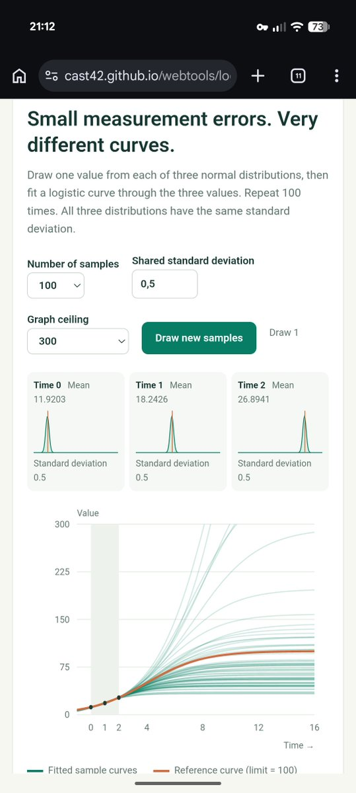

# Small measurement errors, very different growth curves

I published a [small web tool](https://cast42.github.io/webtools/logistic-fit-sensitivity.html), generated with Codex, to explore how measurement errors affect a logistic growth forecast. A logistic curve describes growth that slows and approaches a limit. If you fit one using only three early measurements at equally spaced times, small errors can lead to very different estimates of that limit.

<!-- more -->

The idea comes from John D. Cook's article ["Why fitting a logistic is nearly impossible from early data"](https://www.johndcook.com/blog/2026/09/18/logistic-fit-sensitivity/). Early in the curve, growth is close to exponential. You can fit the observed points closely while still estimating the eventual limit poorly.

In the tool, you draw one value from each of three normal distributions and fit a logistic curve through the sampled values. Repeat the experiment to compare the curves with a reference curve whose limit is 100. You can adjust the shared standard deviation, which controls the size of the measurement errors, and draw new samples.

{ width="420" }

The fitted curves stay close around the measured points, then spread apart as you look further ahead. A close fit to early data gives little assurance about the final level of growth.

[Try the tool](https://cast42.github.io/webtools/logistic-fit-sensitivity.html) and reduce the measurement error to see how the forecasts change. I shared the tool in [my post on X](https://x.com/cast42/status/2106100547350647185).
