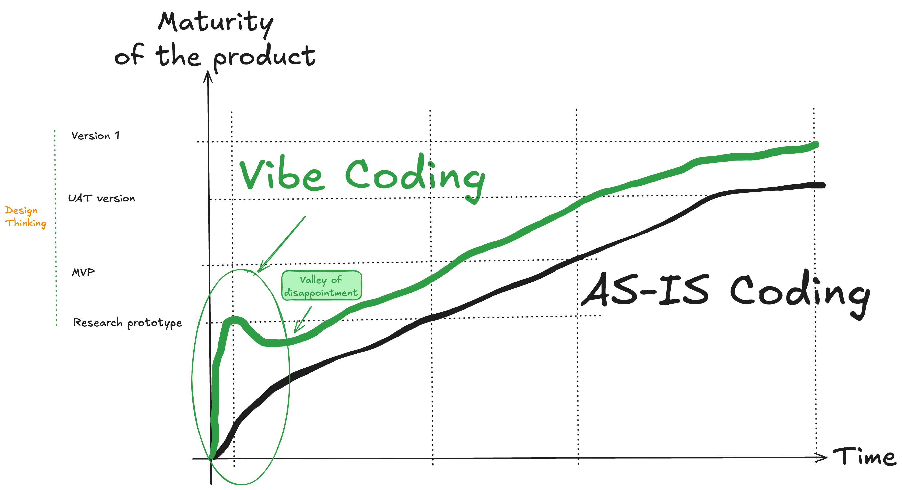

Software development is changing rapidly overnight. Indeed:

1. OpenAI announced Codex  on May 16, 2025, for their $200/month Pro users [https://openai.com/index/introducing-codex/](https://openai.com/index/introducing-codex/).
2. Microsoft GitHub Copilot released its new coding agent on May 19, 2025. [https://bsky.app/profile/github.com/post/3lpjxvgje7s2k](https://bsky.app/profile/github.com/post/3lpjxvgje7s2k)
3. Google announced a tool called Jules (jules.google.com) on May 20, 2025, making it available for free and
4. Mistral releases devstral, an open-source model for coding agents on May 21, 2025. [https://mistral.ai/news/devstral](https://mistral.ai/news/devstral)

These new coding agents—along with Cursor, Lovable, Windsurf, V0, Bold.new, and others—are all tools that support some form of “vibe coding” (a term coined by Karpathy indicating AI-assisted coding).

This gives rise to a lot of FUD (fear, uncertainty, and doubt) from the corporate gatekeepers. The short-term opportunity is this: in a design thinking approach, a “research prototype” that checks the basic hypotheses (who is this product for, what problem does the product solve) can be developed much faster using vibe coding.

Even with the expected “valley of disappointment” that may follow (because users tend to overreact to the initial prototype, which will likely need to be rewritten from scratch), in the end, the chance of building a product that resonates with users is much higher and it will be ready sooner—if the same good old software process is followed, from prototype to Minimum Viable Product (MVP) to Version 1 accepted by users.

<!-- more -->